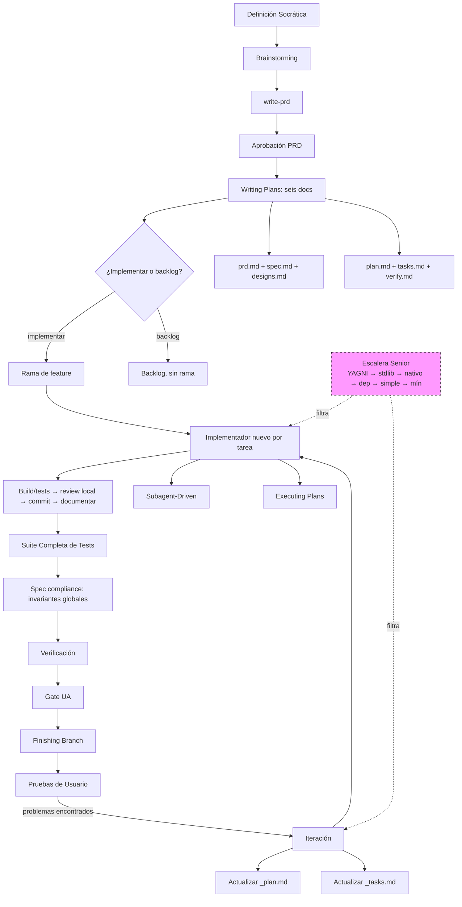
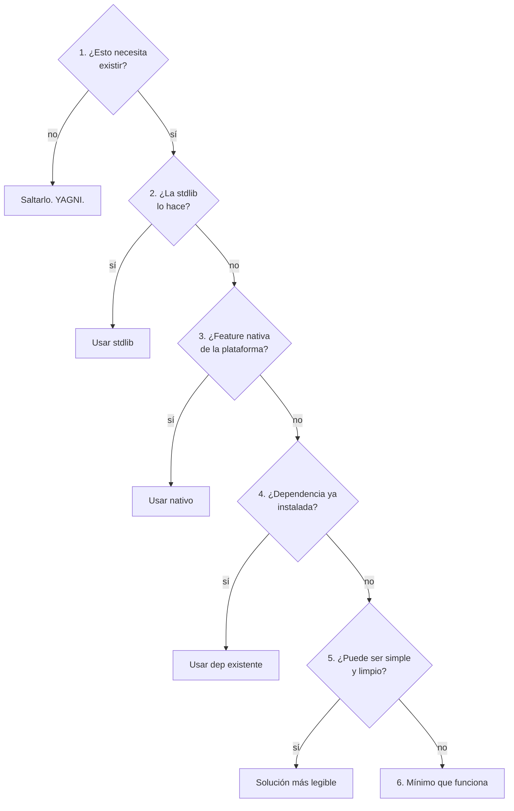
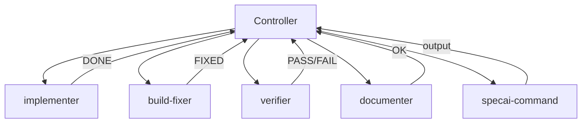
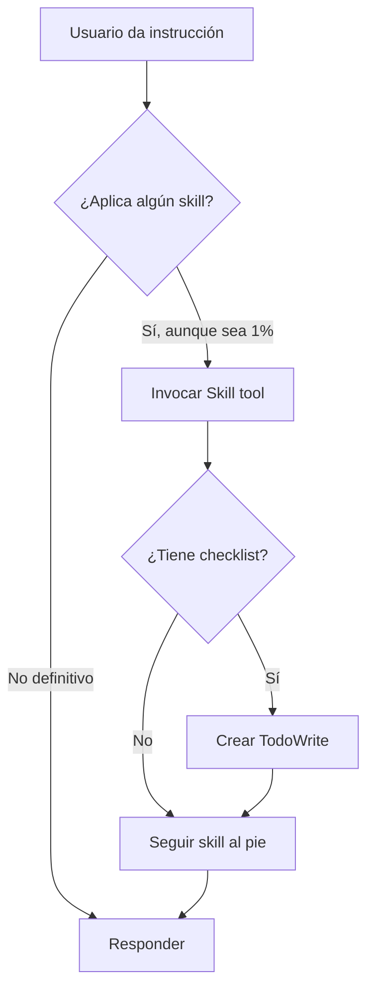

# SpecAI

> **🌐 Idiomas:** [English](README.md) | [Español](README.es.md)

**Una metodología completa de desarrollo de software para agentes de IA.** specai transforma agentes de código en ingenieros disciplinados mediante _skills_ componibles que guían cada fase del desarrollo: desde la idea hasta el merge.

Basado en [Superpowers](https://github.com/obra/superpowers) de [Jesse Vincent](https://blog.fsck.com), adaptado para OpenCode Go con configuración de modelos por rol. La filosofía senior anti-overengineering está inspirada en [Ponytail / Mimocode](https://github.com/pavnxet/Mimocode-ponytail) de [pavnxet](https://github.com/pavnxet).

## Filosofía

specai no es un plugin ni una herramienta: es una **metodología**. Le dice al agente _cómo_ pensar, _cuándo_ preguntar y _cuándo_ actuar. Sus pilares:

| Principio | Descripción |
|-----------|-------------|
| **Skills > Prompts** | Skills componibles que el agente invoca según la tarea |
| **Brainstorming primero** | Jamás se escribe código sin diseño aprobado (incluyendo taxonomía de casos borde y restricciones must-NOT) |
| **Documentos vivos** | Los seis artefactos de cada feature permanecen sincronizados con la ejecución y la verificación |
| **Agentes especializados** | Cada tarea recibe una sesión nueva de implementador y contexto mínimo por rol |
| **Verificar antes de afirmar** | No se dice "funciona" hasta ejecutar el comando |
| **Commits atómicos** | Cada tarea = un commit con build y tests pasando |
| **Senior First** | Cada agente aplica la escalera de decisión antes de escribir código: YAGNI → stdlib → nativo → dependencia existente → simple → mínimo |
| **Validación de Dependencias** | Se auditan los paquetes antes de planificar y se añaden checkpoints de verificación humana antes de instalarlos |
| **Iterar con el usuario** | El usuario prueba → feedback documentado → tareas correctivas → re-entrada al flujo sin reiniciar |

---

## Comparativa: specai vs. Superpowers vs. OpenSpec

Aquí tenés una comparativa real, técnica y de flujo de trabajo que detalla las diferencias y compromisos (trade-offs) entre `specai`, `Superpowers` (de Jesse Vincent) y `OpenSpec` (Spec-Driven Development):

| Dimensión | specai | Superpowers | OpenSpec |
| :--- | :--- | :--- | :--- |
| **Enfoque Principal** | Ejecución multi-agente, TDD estricto y filosofía anti-sobreingeniería | Disciplina estructurada para desarrollo basada en skills | Framework liviano de CLI para especificaciones bajo Git |
| **Orquestación / Agentes**| **7 subagentes dedicados** con mapeo dinámico de modelos por rol | Un solo modelo de agente genérico | Wrapper de documentación agnóstico (sin subagentes nativos) |
| **Sistema de Planes** | Definiciones socráticas -> planes -> seis artefactos vivos (`prd.md`/`spec.md`/`designs.md`/`plan.md`/`tasks.md`/`verify.md`) | Planes estructurados + checklist de tareas atómicas | Ciclo de Proponer -> Revisar -> Aplicar -> Archivar |
| **Optimización de Tokens**| **Caché incremental por secciones** (solo se leen/escriben fragmentos pequeños de los planes) | Reescritura completa de archivos (alto consumo de tokens) | Reescritura completa al proponer/archivar |
| **Guardia Anti-Bloat** | **Escalera de decisión de 6 peldaños** (YAGNI -> stdlib -> nativo) + `/specai-review` / `/specai-audit` | Pautas básicas de YAGNI (sin herramientas de auditoría) | Ninguna (no dicta reglas ni estilo de codificación) |
| **Puentes con Entornos** | Puentes nativos (ej. `specai-antigravity-bridge`) para evitar conflictos de planes | Ninguno | Ninguno |
| **Herramientas y CLI** | Manager unificado `./specai` con menú interactivo TUI | Script instalador estándar | CLI independiente de npm (`@fission-ai/openspec`) |

### Dónde brilla specai
- **Eficiencia de costos:** Los modelos se configuran por rol; la documentación y los comandos mecánicos usan el modelo viable más barato, mientras que implementación y juicio usan modelos más capaces. El aislamiento de contexto, los handoffs acotados y las actualizaciones incrementales evitan multiplicar los tokens de entrada.
- **Contra la sobreingeniería:** La escalera de decisión y las auditorías de bloat obligan a la IA a escribir el mínimo código necesario, evitando caer en abstracciones prematuras (como fábricas o interfaces innecesarias para un solo caso).
- **Rigor y seguridad:** La revisión de código obligatoria por tarea, los gates de build y el debugging sistemático aseguran una alta calidad de software.
- **Actualizaciones incrementales:** Los agentes documentadores solo leen/escriben fragmentos relevantes, lo que mantiene el contexto pequeño y rápido. Si una consulta devuelve `timed_out`, el controlador conserva el handle y vuelve a consultar: no interrumpe ni relanza el agente.

### Compromisos y limitaciones (Trade-offs)
- **Ceremony y proceso:** Al imponer un ciclo de vida tan estricto (preguntas socráticas, planes detallados, subagentes, reviews), introduce fricción. Para cambios de una sola línea puede resultar pesado (aunque existe `/specai-mini` para reducir la ceremonia).
- **Complejidad de instalación:** Requiere configurar múltiples agentes en el IDE y enlazar los directorios de skills.

En un flujo de SpecAI, incluso un cambio mecánico usa el mismo contrato de
aceptación. Un cambio de una sola línea realizado fuera de un plan no se
representa como una tarea de feature; si entra en el flujo, recibe instrucciones
exactas y criterios verificables igual que un cambio grande.

---

## Flujo de Trabajo Completo



### Escalera de Decisión Senior

Cada subagente evalúa el mejor enfoque de arriba a abajo, deteniéndose en el primer peldaño que se cumple:



Marca las simplificaciones deliberadas con `// td: <límite>, <camino de upgrade>`.

**Nunca simplificar:** validación en fronteras de confianza, errores que previenen pérdida de datos, seguridad, accesibilidad, lo pedido explícitamente.

---

### 0. ❓ Definición Socrática — Antes de Todo

> **Obligatorio:** Antes del diseño o código, la skill `grill-me` ejecuta una entrevista socrática relentless una-pregunta-a-la-vez, mapeando el árbol de diseño. La skill `write-prd` convierte ese árbol en un PRD formal que el usuario debe aprobar antes de cualquier plan. El implementador NO debe tomar decisiones de diseño ni hacer suposiciones.

### 1. 🧠 Brainstorming — La Fase Más Importante

> **Regla de hierro:** NO se escribe una línea de código sin diseño aprobado.

El `grill-me` es el corazón de specai. Ejecuta una entrevista socrática relentless una-pregunta-a-la-vez para refinar ideas antes de tocar código: cada pregunta con contexto del codebase y opciones recomendadas.

#### Las Rondas Dimensionales

| Dimensión | Propósito | Ejemplo |
|-----------|-----------|---------|
| **Propósito y alcance** | Define qué, para quién, qué queda fuera | _"¿La app de notas es solo para uso personal o incluye colaboración en equipo?"_ |
| **Restricciones y principios** | Define límites y no-negociables | _"¿Debe funcionar offline o solo online?"_ |
| **Datos y modelo** | Define estructura y persistencia | _"¿Las notas tienen tags, categorías, o ambas?"_ |
| **Comportamiento y flujos** | Define interacciones y estados | _"¿El usuario puede editar notas existentes o solo crear/borrar?"_ |
| **Edge cases y errores** | Define manejo de fallos y límites | _"¿Qué pasa si el usuario intenta crear una nota sin conexión?"_ |
| **Integraciones** | Define dependencias externas | _"¿Necesita sincronizar con algún servicio externo?"_ |

**Max 5 preguntas por ronda**, cada una con recomendación + opción "escribe tu propia respuesta". Se continúa hasta cubrir todas las dimensiones relevantes.

#### Checklist de Brainstorming

1. Explorar contexto del proyecto (archivos, docs, commits recientes)
2. Ofrecer companion visual (si el tema lo requiere)
3. Preguntas clarificadoras (rondas dimensionales, max 5 por ronda)
4. Proponer 2-3 enfoques con trade-offs y recomendación
5. Presentar diseño por secciones (aprobación incremental)
6. Escribir el diseño (spec) a `docs/specai/<spec-name>/<spec-name>-designs.md` incluyendo el **Análisis de Casos Borde** (límites, adyacencia, vacío, codificación, ordenamiento, precisión, idempotencia, concurrencia) y las **Restricciones del Sistema (must-NOTs)**.
7. Escaneo de ambigüedades
8. Auto-revisión del spec
9. El usuario revisa el spec escrito
10. Transición a la planificación

#### Anti-Patrón: "Es Demasiado Simple"

Cada proyecto pasa por la cadena socrática + grill-me + write-prd. Una TODO list, una utilidad de una función, un cambio de configuración — todos. Los proyectos "simples" son donde las suposiciones no examinadas causan más trabajo perdido.

---

### 2. 📝 Writing Plans

Crea la carpeta de feature `docs/specai/<spec-name>/` con los mismos seis documentos de implementación en Full y en forma compacta en Mini:

| Archivo | Propósito |
|---------|-----------|
| `<spec-name>-prd.md` | Requisitos de producto aprobados: problema, historias, decisiones, restricciones, casos borde y fuera de alcance |
| `<spec-name>-spec.md` | Contrato funcional y delta frente a la especificación del proyecto afectada |
| `<spec-name>-designs.md` | Poblado desde los artefactos de grill-me + write-prd, con arquitectura y specs |
| `<spec-name>-plan.md` | Plan de implementación, goal, tech stack y log de ejecución |
| `<spec-name>-tasks.md` | Tareas atómicas de 2-5 minutos cada una (formato checklist) |
| `<spec-name>-verify.md` | Criterios de aceptación globales y plantilla de verificación final |

Cada tarea especifica exactamente el objetivo y la ubicación —clase, componente,
método, selector o símbolo—, el valor actual, el cambio solicitado, la
aserción exacta, los archivos permitidos, los comandos con salida esperada y
los tests a escribir. Cada criterio de verificación declara `Criterion type`,
`Invariant`, `Verification seam` y un escenario `Given / When / Then`.

Full y Mini usan los mismos seis artefactos: `prd.md`, `spec.md`, `designs.md`,
`plan.md`, `tasks.md` y `verify.md`. Mini reduce la densidad del contenido y la
ceremonia, pero conserva las instrucciones exactas de cada tarea, los criterios
globales `Given / When / Then`, los metadatos del criterio, la evidencia, el
bucle correctivo, el momento de crear la rama y el Gate UA.

#### Gate de Validación de Dependencias

Cuando el plan introduce una nueva dependencia externa, se realiza un control de seguridad y legitimidad:
1. El planificador audita la reputación del paquete (edad, descargas, salud del repositorio) para detectar typosquatting o baja reputación.
2. Se lista el paquete bajo la sección `## Dependency & Package Validation` en el plan.
3. Se añade un paso explícito `checkpoint:human-verify` en `<spec-name>-tasks.md` antes de instalar el paquete, garantizando que el usuario apruebe su instalación antes de que sea ejecutada.

---

### 3. ⚙️ Subagent-Driven Development

El motor de ejecución. Despacha agentes especializados con **contexto mínimo**:



#### Ciclo por Tarea

1. **Sesión nueva del implementador** con SOLO su tarea, la sección relevante de la spec, hechos de investigación y metadatos de scheduling. Nunca hereda la conversación padre.
2. Implementer reporta: `DONE`, `DONE_WITH_CONCERNS`, `NEEDS_CONTEXT`, o `BLOCKED`
3. **Build y tests** vía `specai-command` (el implementador puede hacer su propia comprobación)
4. Si falla: dispatch **build-fixer** con el error y el código relevante (diff mínimo)
5. Dispatch **code-reviewer** antes del commit: debe aprobar calidad y emitir `Compliance verdict: PASS` para cada criterio local de la tarea
6. Si hay fallos CRITICAL/IMPORTANT o de cumplimiento: corregir, repetir build/tests y revisar de nuevo
7. **Commit** solo cuando build/tests y ambos veredictos pasen
8. **Documenter** actualiza los documentos vivos tras cada transición, error, commit y resultado del verifier
9. Tras todas las tareas: suite completa → `spec-compliance-reviewer` (incluidas invariantes globales entre tareas) → `verifier`
10. Los metadatos de sesión son efímeros; la recuperación se reconstruye desde `*-tasks.md` y el `Execution Log` de `*-plan.md`. `TodoWrite` es solo el espejo de sesión.

Antes de implementar cada tarea se registra `TASK_STARTED` en el log del plan con `timestamp`, `branch`, `git_hash`, `task_id` y contexto. Una nueva sesión recupera todas las tareas `in_progress`; sin tareas activas selecciona la primera `pending` elegible y se bloquea ante inconsistencias. Los checkpoints de aprobación humana y revisión siguen siendo gates de decisión, no persistencia de sesión.

#### Caching Inteligente

Si una tarea solo modifica tests y `src/` no cambió, se salta el build (ahorra 30-50% de tokens). Un `timed_out` de una consulta solo agota el intervalo de espera: se conserva el handle y se vuelve a consultar; no se interrumpe ni se relanza el agente.

---

### 4. ✅ Verificación

El **verifier** compara el resultado final contra los criterios de aceptación del `_verify.md`:

```
GOAL_COMPLETE → Gate UA (aceptación del usuario)
PARTIAL/FAIL/UNVERIFIED → Generar tareas correctivas exactas → volver a despachar implementador → verificar de nuevo
```

`_verify.md` es un contrato de objetivo, no solo una lista de tests. Vincula
cada criterio (`C1`, `C2`, ...) con tareas, comandos exactos, resultados
esperados y evidencia fresca. El objetivo no puede pasar mientras haya una
tarea abierta, un criterio parcial o una tarea correctiva sin resolver.

Todos los criterios usan el mismo escenario `Given / When / Then`, también los
cambios mecánicos. `Then` debe contener el literal o la aserción observable
exacta; no se acepta una descripción cualitativa como “más grande” o “más
legible”.

Las tareas demuestran cambios locales; los criterios demuestran el objetivo
completo. Cada criterio declara `Criterion type`, `Invariant` y `Verification
seam`. Si abarca varias pantallas, componentes, módulos o tareas, debe ser
`ARCHITECTURE` o `INTEGRATION` y el verifier debe comprobar la relación completa
en esa seam. Por ejemplo, “las pantallas de estadísticas son iguales” exige
que ambos entrypoints usen el mismo componente de pantalla, que los datos
específicos de cada juego entren mediante el adaptador declarado y que no haya
dos layouts duplicados. Que sus subtareas estén marcadas como completadas no
prueba por sí solo esa invariante.

---

### 5. 🔄 Iteración — Ciclo de Feedback del Usuario

Después de que la verificación pasa y el usuario prueba la implementación manualmente, si se encuentran problemas, el ciclo de iteración documenta el feedback y re-entra al flujo de ejecución **sin reiniciar** desde grill-me.

```
Usuario prueba → encuentra problemas → specai-iteration →
  Actualizar _plan.md (entrada de log de iteración) +
  Actualizar _tasks.md (tareas correctivas) →
  Re-entrar ejecución (implement → build → document → verify) →
  Suite completa de tests → Verifier → Finishing
```

**Reglas:**
- NO reiniciar el flujo completo (socrático → grill-me → write-prd) para correcciones pequeñas
- NO crear un nuevo directorio de feature — añadir tareas correctivas a los docs existentes
- SIEMPRE ejecutar la suite completa de tests tras tareas correctivas
- Las reglas de commit aplican también durante la iteración
- Salir solo cuando el usuario confirme que la implementación funciona como espera

**Skills relacionadas:** `specai-iteration`, `specai-documentation`, `specai-subagent-driven-development`

---

### 6. 🏁 Finishing a Development Branch

Cuatro opciones presentadas al usuario:

| Opción | Merge local | Push & PR | Worktree vivo | Borra branch |
|--------|-------------|-----------|---------------|--------------|
| 1. Merge local | ✅ | ❌ | ❌ | ✅ |
| 2. Push + PR | ❌ | ✅ | ✅ | ❌ |
| 3. Keep as-is | ❌ | ❌ | ✅ | ❌ |
| 4. Descartar | ❌ | ❌ | ❌ | ✅ (force) |

---

## Filosofía Senior

specai aplica una **escalera de decisión senior** antes de escribir cualquier código. Cada subagente evalúa el mejor enfoque de arriba a abajo, deteniéndose en el primer peldaño que se cumple:

| Peldaño | Pregunta | Si sí |
|---------|----------|-------|
| 1 | ¿Esto necesita existir? | Saltarlo (YAGNI) |
| 2 | ¿La stdlib lo hace? | Usar stdlib |
| 3 | ¿Una feature nativa de la plataforma lo cubre? | Usar nativo (ej. `<input type="date">` en vez de flatpickr) |
| 4 | ¿Una dependencia ya instalada lo resuelve? | Usarla, nunca añadir una nueva por lo que unas pocas líneas pueden hacer |
| 5 | ¿Puede ser simple y limpio? | La solución más legible (a veces 3 líneas claras > 1 línea críptica) |
| 6 | Solo entonces | El mínimo código que funciona |

### Niveles de Intensidad

| Nivel | Comportamiento |
|-------|----------------|
| **off** | specai normal, sin cambios |
| **lite** | Construye lo pedido + sugiere alternativa más simple en una línea |
| **medium** | Escalera completa, minimalismo activo (**por defecto**) |
| **ultra** | YAGNI extremo, cuestiona la tarea misma antes de implementar |

Cambiar con `/specai-mode lite|medium|ultra|off` o editar `~/.config/specai/config.json` (`seniorMode`).

### Reglas de Minimalismo

- Sin abstracciones no pedidas: no interface con una implementación, no factory para un producto, no config para un valor que nunca cambia
- Sin boilerplate ni scaffolding "para después" — después puede hacer su propio scaffolding
- Borrar sobre añadir. Aburrido sobre ingenioso
- Menos archivos posible. El diff funcional más corto gana
- Marcar simplificaciones deliberadas con `// td: <límite>, <camino de upgrade>`
- Output: código primero, máximo tres líneas de explicación

### Revisión Anti-Bloat

| Comando | Qué hace |
|---------|----------|
| `/specai-review` | Revisa el diff actual por sobre-ingeniería (delete/stdlib/native/yagni/shrink). Termina con `net: -N lines possible.` |
| `/specai-audit` | Audita todo el repo por bloat, ordenado por impacto. Termina con `net: -N lines, -M deps possible.` |
| `/specai-audit-plan` | Auditoría full-project (bloat + arquitectura) → triage interactivo → specai-plan. |

---

## Reglas de Commit

Configurable mediante `commitMode` en `~/.config/specai/config.json` (por defecto: `auto`).

**En una rama de feature** (no `main`, `master`, `develop`, `dev`):

| Modo | Comportamiento |
|------|----------------|
| **auto** | Hace commit AUTOMÁTICAMENTE sin preguntar. Anuncia y continúa. |
| **confirm** | PARA tras cada tarea y pregunta: "¿Listo para commit? [Y/n]" |
| **manual** | Nunca hace commit automático. Anuncia "Cambios listos." |

**Cuando NO está en una rama de feature:**
- PARA. No hace commit.
- No se permite commit directo en `main`, `master`, `develop` ni `dev`.
- La única continuación válida es crear la rama de feature después de la elección explícita de implementar, o conservar el trabajo sin commit mientras se aclara la decisión.
- Espera la decisión del usuario antes de proceder.

---

## Skills Completas

| Skill | Propósito | Tipo |
|-------|-----------|------|
| **agent-models** | Configurar modelo de IA por rol de subagente | Flexible |
| **anti-bloat** | Tres sub-skills: review (diff), audit (repo), debt (ledger de `// td:`) | Flexible |
| **antigravity-bridge** | Usar cuando el modo plan de Antigravity tiene conflictos con el flujo de specai — previene creación de planes paralelos | Rígido |
| **backlog** | Lee `.specai/backlog.json` para mostrar y seleccionar planes pendientes por número | Flexible |
| **bootstrap** | Reglas de invocación de skills y arranque — cómo encontrar y usar skills | Rígido |
| **grill-me** | Entrevista socrática relentless una-pregunta-a-la-vez que mapea el árbol de diseño | Rígido |
| **write-prd** | Genera el PRD formal a partir del árbol de diseño resuelto | Rígido |
| **checkpoints** | Recuperación documental y metadatos efímeros de sesión; sin checkpoint persistente | Flexible |
| **code-review** | Revisión de código automatizada con `code-reviewer` por tarea y `spec-compliance-reviewer` al final | Rígido |
| **command** | Delegación de ejecución de comandos — todos los comandos pasan por `specai-command` | Rígido |
| **dispatching-parallel-agents** | Múltiples agentes en paralelo para fallos independientes | Flexible |
| **documentation** | Sincronización de documentos vivos — los seis artefactos de feature, README y documentos relacionados | Rígido |
| **domain-modeling** | Construye el glosario (`CONTEXT.md`) y los ADRs para establecer un lenguaje común | Rígido |
| **executing-plans** | Ejecución batch con recuperación documental para implementaciones largas | Flexible |
| **finishing-a-development-branch** | Merge/PR/descartar con cleanup | Rígido |
| **iteration** | Ciclo de feedback del usuario: documentar problemas → tareas correctivas → re-entrar ejecución | Rígido |
| **judgment-day** | Revisión adversarial dual-blind pre-PR — dos jueces, solo issues confirmados se arreglan | Flexible |
| **living-documents** | Mantener specs, design, plan y tasks sincronizados durante la implementación | Flexible |
| **receiving-code-review** | Responder al feedback con rigor técnico, no acuerdo performativo | Flexible |
| **requesting-code-review** | Checklist pre-review antes de pedir feedback | Flexible |
| **senior-philosophy** | Escalera de decisión anti-overengineering (6 peldaños), niveles de intensidad, minimalismo | Rígido |
| **socratic-clarifier** | Resolver ambigüedades en specs mediante preguntas socráticas hiper-concisas | Flexible |
| **subagent-driven-development** | Ejecución con agentes especializados por rol, cada uno con contexto mínimo | Rígido |
| **systematic-debugging** | 4 fases: causa raíz → patrón → hipótesis → fix | Rígido |
| **test-driven-development** | Ciclo RED-GREEN-REFACTOR con triangulación | Rígido |
| **using-git-worktrees** | Aislamiento de workspace paralelo mediante git worktrees | Flexible |
| **verification-before-completion** | Nunca afirmar sin ejecutar el comando — evidencia antes que afirmaciones | Rígido |
| **writing-plans** | Crea los seis artefactos de feature con tareas atómicas de 2-5 min cada una | Rígido |
| **writing-skills** | TDD aplicado a crear y verificar nuevas skills | Rígido |

---

## Agentes y Modelos

specai usa los **siete subagentes core** definidos en `scripts/agent-roster.json`, con modelos configurables por rol:

| Agente | Rol | Modelo por defecto |
|--------|-----|-------------------|
| `implementer` | Implementa UNA tarea atómica con contexto mínimo | `minimax/MiniMax-M3` |
| `build-fixer` | Resuelve errores de compilación — fix con diff mínimo | Configurado en roster/config |
| `verifier` | Compara implementación contra criterios globales de aceptación | Configurado en roster/config |
| `code-reviewer` | Revisa calidad y cumplimiento local antes de cada commit | Configurado en roster/config |
| `spec-compliance-reviewer` | Revisa implementación completa, coherencia entre tareas e invariantes globales | Configurado en roster/config |
| `specai-command` | Ejecuta comandos (build, test, git). Ningún otro agente ejecuta comandos directamente | Configurado en roster/config |
| `specai-documentation` | Crea y actualiza toda la documentación. Ningún otro agente escribe docs directamente | Configurado en roster/config |

**Reglas críticas:**
- Ningún agente ejecuta comandos directamente (excepto `implementer` para verificar su propio trabajo) — todo se delega a `specai-command`
- Ningún agente escribe documentación directamente — todo se delega a `specai-documentation`
- Cada `implementer` recibe SOLO su tarea: sin plan, sin otras tareas, sin log de ejecución
- **Dos niveles de revisión**: el `code-reviewer` comprueba calidad y cumplimiento local antes de cada commit; el `spec-compliance-reviewer` comprueba la implementación completa y las invariantes globales antes del verifier.

### Cambiar Modelos

```bash
# En conversación: usa el tool specai-configure-model
# En terminal:
bash scripts/configure-agents.sh implementer "anthropic/claude-sonnet-4-20250514"
# Interactivo:
bash scripts/configure-agents.sh --interactive
```

---

## Instalación

### OpenCode (Recomendado)

Añade specai al array `plugin` en tu `opencode.json`:

```json
{
  "plugin": ["specai@git+https://github.com/ArceApps/specai.git"]
}
```

El plugin auto-registra:
- **7 subagentes** (`@implementer`, `@build-fixer`, `@code-reviewer`, `@verifier`, `@spec-compliance-reviewer`, `@specai-command`, `@specai-documentation`)
- **13 slash commands** (`/specai-plan`, `/specai-mini`, `/specai-explore`, `/specai-verify`, `/specai-review`, `/specai-iterate`, `/specai-mode`, `/specai-audit`, `/specai-audit-plan`, `/specai-backlog`, `/specai-init`, `/specai-finish`, `/specai-config`)
- **1 herramienta built-in** (`specai-configure-model`)
- **Las 39 skills** bajo `skills/`

> **¿Por qué tantas skills si hay tan pocos comandos?** El número de skills y
> el número de slash commands están desacoplados a propósito. Cada skill es
> un procedimiento de alcance estricto — la unidad mínima de comportamiento
> que un subagente concreto invoca con el contexto exacto que necesita.
> Las skills se dividen por responsabilidad (entrevista, diseño, plan,
> implementación, revisión, commit, documentación, verificación, cierre,
> iteración…), no por comando. Un solo `/specai-plan` acaba cargando
> varias skills en secuencia, pero el agente que ejecuta un único paso
> solo ve el procedimiento que ese paso necesita realmente. Skills más
> grandes y en menor número obligarían a cada subagente a cargar
> instrucciones de trabajo que jamás va a hacer, que es exactamente el
> prompt-rot que tratamos de evitar. Los 13 slash commands se mantienen
> como superficie fija y memorable; el conjunto de skills puede crecer a
> medida que la metodología gana distinciones más finas.

Después de añadir el plugin, ejecuta:

```bash
bash scripts/setup-agents.sh          # Inyecta agentes y comandos en la config de OpenCode
```

### Antigravity / Codex / OpenCode / Hermes / Universal (CLI Unificada)

Usá el manager unificado `specai` para enlazar, instalar, actualizar, diagnosticar y configurar en los harnesses detectados:

```bash
./specai link           # Enlace de desarrollo en vivo para harnesses detectados (Antigravity, Codex, OpenCode, Hermes, Universal)
./specai install        # Instalación pública en los harnesses detectados
./specai update         # Actualiza desde el origen remoto y refresca los harnesses detectados
./specai doctor         # Diagnostica la salud de todos los harnesses, skills y subagentes
./specai config         # Abre la TUI de configuración interactiva
```

Cada harness tiene su propia configuración (ej. `.antigravity-plugin/`, `.cursor-plugin/`, `.codex-plugin/`, `.droid-plugin/`). Antigravity descubre los siete subagentes nativos bajo `.antigravity-plugin/agents/` y los despacha con `invoke_subagent`. Hermes es la excepción — no hay `.hermes-plugin/` porque descubre los skills leyendo directamente los `SKILL.md` bajo `$HERMES_HOME/skills/`.

- **Factory Droid**: Factory Droid levanta automáticamente las reglas e instrucciones del proyecto desde `AGENTS.md` y respeta el flujo de specai al cargar el harness.
- **GitHub Copilot CLI**: Aprovecha la inyección de contexto de `additionalContext` en el hook `sessionStart` (detectado mediante la variable de entorno `COPILOT_CLI`) para inyectar el bootstrap completo de specai al iniciar la sesión.
- **Hermes (Nous Research)**: los skills se symlinkean a `~/.hermes/skills/<name>` (uno por skill). Verificá con `hermes skills list | grep specai`. Hermes no consume `commands.json` ni definiciones de subagentes nativos; su alcance es la proyección de skills.

### Contrato de subagentes nativos

El mismo roster de siete roles se proyecta mediante cada harness nativo:

| Harness | Dispatch nativo | Capacidad requerida |
|---------|-----------------|---------------------|
| OpenCode | `delegate` | siete roles registrados como `mode: subagent` |
| Codex | `spawn_agent` → `wait_agent` → `close_agent` | `[features] multi_agent = true` |
| Antigravity | `invoke_subagent` | siete agentes Markdown con `subagent: true` |

Todos los handoffs usan `scripts/agent-harness-contract.json`: 900 segundos
de runtime máximo, polling de 15 segundos y heartbeat de 30 segundos. Ejecuta
el diagnóstico read-only antes de despachar:

```bash
bash scripts/specai-harness-doctor.sh --json
```

Si falta una capacidad nativa, SpecAI se bloquea con un diagnóstico accionable;
nunca ejecuta el trabajo inline de forma silenciosa.

### Actualización Post-Clone

Después de hacer pull de nuevos cambios, refresca todo:

```bash
./specai update
```

Esto actualiza desde el repositorio remoto y refresca todos los harnesses detectados en un solo paso.

---

## Uso

### Slash Commands (dentro de OpenCode)

| Comando | Descripción |
|---------|-------------|
| `/specai-plan` | Ejecuta el flujo SpecAI completo (socrática → grill-me → write-prd → plan → ciclo por tarea → verifier → user-acceptance → finishing). |
| `/specai-mini` | Modo mini: socrática → seis artefactos compactos → elección implementar/backlog → rama solo si se implementa → implement → verify. Para features pequeñas y bug fixes. |
| `/specai-explore` | Explora el codebase interactivamente — sin artefactos, sin compromiso. Thinking partner que lee código y sopesa opciones antes de escribir nada. |
| `/specai-verify` | Verifica la implementación contra los criterios de aceptación. |
| `/specai-review` | Revisa el diff actual por anti-bloat (tags: delete/stdlib/native/yagni/shrink). |
| `/specai-iterate` | Bucle de feedback del usuario: documentar problemas, añadir tareas correctivas, re-entrar en ejecución. |
| `/specai-mode` | Establece la intensidad de filosofía senior: `off`, `lite`, `medium` o `ultra`. |
| `/specai-audit` | Audita todo el repo por bloat, ordenado por impacto. |
| `/specai-audit-plan` | Auditoría full-project (bloat + arquitectura) → triage interactivo → specai-plan. |
| `/specai-backlog` | Muestra los planes pendientes de `.specai/backlog.json`. Selecciona por número para ejecutar. |
| `/specai-init` | Inicializa `docs/specai/`, verifica la config, asegura que los agentes estén configurados. |
| `/specai-finish` | Finaliza una rama de desarrollo aceptada eligiendo merge, PR, conservar o descartar. |
| `/specai-config` | Muestra o cambia modelos de agentes, idioma y modo de commit interactivamente. |

### Comandos CLI (`./specai <comando>`)

Ejecuta sin argumentos para el **menú TUI interactivo**, o con un comando:

| Comando | Alias | Descripción |
|---------|-------|-------------|
| `link` | `--link` | Enlace de desarrollo en vivo para harnesses detectados (Antigravity, Codex, OpenCode, Hermes, Universal) |
| `install` | `--install`, `-i` | Instalación pública en los harnesses detectados |
| `update` | `--update`, `-u` | Actualiza desde el origen remoto y refresca los harnesses detectados |
| `doctor` | `--doctor` | Diagnostica la salud de todos los harnesses, skills y subagentes |
| `config` | `--config` | Abre la TUI de configuración interactiva |
| `unlink` | `--unlink` | Desvincula y limpia SpecAI de los harnesses detectados |
| `help` | `--help`, `-h` | Muestra ayuda de uso |

**Ejemplo:**
```bash
./specai                    # Abrir menú interactivo TUI
./specai link               # Enlazar en vivo en harnesses detectados
./specai install            # Instalar en harnesses detectados
./specai doctor             # Ejecutar diagnóstico de salud integral
./specai config             # Configurar modelos interactivamente
```

### Herramienta Built-in: `specai-configure-model`

Cambia el modelo de cualquier subagente en tiempo de ejecución desde una conversación:

**Parámetros:**
- `agent`: uno de los siete agentes core definidos en `scripts/agent-roster.json`
- `model`: ID completo del modelo (ej. `minimax/MiniMax-M3`, `anthropic/claude-sonnet-4-20250514`)

Actualiza `~/.config/specai/config.json` y aplica el cambio inmediatamente.

### Scripts (`bash scripts/<script>.sh`)

| Script | Descripción |
|--------|-------------|
| `setup-agents.sh` | Inyecta los 7 subagentes y slash commands en `~/.config/opencode/opencode.json` |
| `configure-agents.sh` | Lee/escribe `~/.config/specai/config.json` para modelos, idioma, modo de commit y modo senior |
| `uninstall-agents.sh` | Elimina las definiciones de agentes specai de la config de OpenCode |
| `bump-version.sh` | Incrementa versión en todos los archivos declarados con detección de drift |
| `sync-to-codex-plugin.sh` | Sincroniza specai al fork del plugin Codex |

**Subcomandos de `configure-agents.sh`:**

| Subcomando | Descripción |
|------------|-------------|
| `implementer minimax/MiniMax-M3` | Cambiar el modelo de un agente |
| `--language <auto\|en\|es>` | Establecer idioma de documentos |
| `--interactive` | Prompt interactivo para todos los agentes |
| `--reset` | Resetear toda la config a valores por defecto |

---

## Documentación Viva

Durante la implementación, los seis documentos de la feature se mantienen sincronizados por el agente `specai-documentation`:

| Archivo | Lo lee | Lo escribe | Cuándo se actualiza |
|---------|--------|------------|---------------------|
| `<spec-name>-tasks.md` | `implementer` (una tarea) | `documenter` | Tras cada transición, error, commit y resultado del verifier |
| `<spec-name>-plan.md` | `verifier` | `documenter` | Log de ejecución y estado de recuperación |
| `<spec-name>-prd.md` | agentes de planificación/revisión | `documenter` | Durante cambios aprobados de requisitos |
| `<spec-name>-spec.md` | agentes de implementación/revisión | `documenter` | Cuando cambia el contrato funcional |
| `<spec-name>-designs.md` | agentes de implementación/revisión | `documenter` | Cuando cambia una decisión de diseño aprobada |
| `<spec-name>-verify.md` | `verifier` | `documenter` | Cuando cambian criterios, evidencia o correctivos |

Nunca se pasan los seis archivos a la vez a un agente — solo la sección acotada que necesita.

### Patrón de Delegación Token-Eficiente

Para evitar gastar tokens leyendo archivos grandes para actualizaciones pequeñas:

1. El **controlador** prepara el evento, la ruta exacta, la sección relevante y el cambio solicitado
2. El **documenter** recibe el handoff acotado y lee/escribe solo la sección documental indicada
3. El **controlador** registra el estado devuelto — nunca aplica un segundo parche documental

Esto mantiene los documentos vivos actualizados sin quemar tokens en contexto.

### Reglas de Actualización de Documentos Vivos

**Tras CADA tarea completada:**
- `_tasks.md` — marcar pasos completados
- `_plan.md` — añadir entrada de log de ejecución

**Tras CADA commit:**
- `_plan.md` — añadir entrada de log de commit
- `_tasks.md` — asegurar que todos los pasos completados estén marcados

**Cuando ocurren errores:**
- `_plan.md` — añadir entrada de error con: qué pasó, causa raíz, fix aplicado, lecciones aprendidas
- `_tasks.md` — añadir tareas correctivas si es necesario

**Durante la iteración (feedback del usuario):**
- `_plan.md` — añadir entrada de log de iteración
- `_tasks.md` — añadir tareas correctivas bajo `## Iteration Tasks`

**Estos son cuadernos de bitácora vivos — siempre deben reflejar la realidad.**

---

## Tabla de Evidencia TDD

Cuando se usa TDD dentro de subagent-driven development, cada `implementer` reporta:

| Task | Test File | Layer | Safety Net | RED | TRIANGULATE | REFACTOR |
|------|-----------|-------|------------|-----|-------------|----------|
| 1.1 | `tests/auth.test.ts` | Unit | ✅ 5/5 | ✅ Written | ✅ 2 cases | ✅ Clean |
| 1.2 | `tests/api.test.ts` | Integration | N/A (new) | ✅ Written | ➖ Single output | ✅ Clean |

El `verifier` revisa esta tabla contra los criterios de aceptación.

---

## Flujo de Skills (Diagrama)



**Red Flags** (pensamientos que indican PARAR y revisar):

| Pensamiento | Realidad |
|-------------|----------|
| "Es solo una pregunta simple" | Las preguntas son tareas. Revisa skills. |
| "Necesito más contexto primero" | La revisión de skills va ANTES de preguntar. |
| "Déjame explorar el código primero" | Los skills dicen CÓMO explorar. Revísalos primero. |
| "Esto no necesita un skill formal" | Si el skill existe, úsalo. |
| "Me acuerdo de este skill" | Los skills evolucionan. Lee la versión actual. |

---

## Licencia

MIT — ver [LICENSE](LICENSE).

## Créditos

- **Superpowers** por [Jesse Vincent](https://blog.fsck.com) y [Prime Radiant](https://primeradiant.com) — la metodología original basada en skills para agentes de IA que inspiró la arquitectura de skills componibles de specai
- **Ponytail / Mimocode** por [pavnxet](https://github.com/pavnxet/Mimocode-ponytail) — la filosofía senior anti-overengineering (escalera de decisión, minimalismo, YAGNI) que inspira `specai-senior-philosophy` y `specai-anti-bloat`
- **specai** por [ArceApps](https://github.com/ArceApps)
