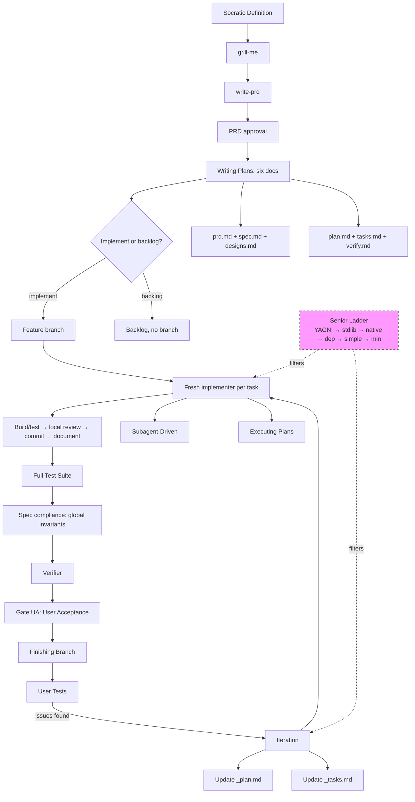
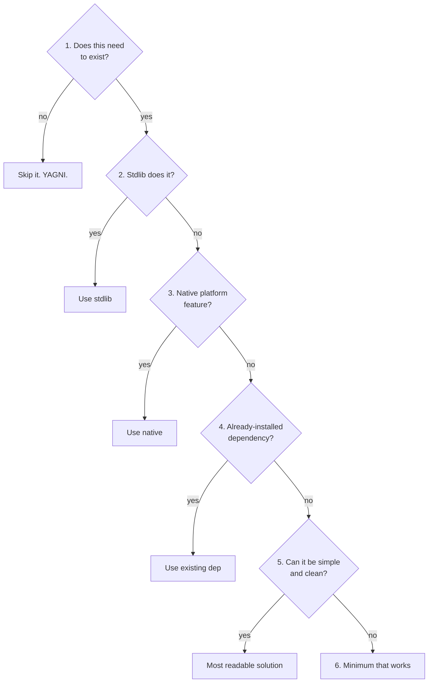
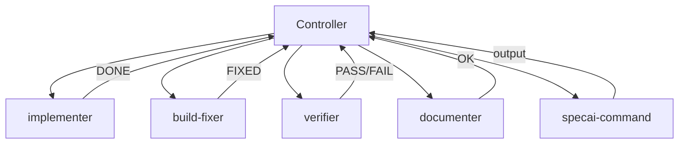
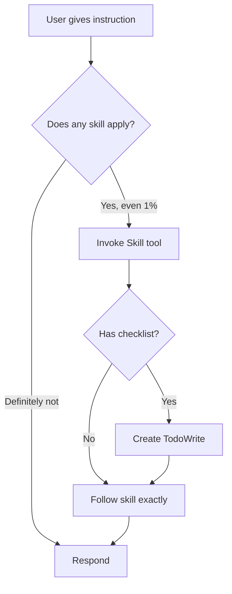

# SpecAI

> **🌐 Languages:** [English](README.md) | [Español](README.es.md)

**A complete software development methodology for AI coding agents.** specai turns code agents into disciplined engineers through composable _skills_ that guide every development phase: from idea to merge.

Based on [Superpowers](https://github.com/obra/superpowers) by [Jesse Vincent](https://blog.fsck.com), adapted for OpenCode Go with per-role model configuration. Senior anti-overengineering philosophy inspired by [Ponytail / Mimocode](https://github.com/pavnxet/Mimocode-ponytail) by [pavnxet](https://github.com/pavnxet).

## Philosophy

specai is not a plugin or a tool: it's a **methodology**. It tells the agent _how_ to think, _when_ to ask, and _when_ to act. Its pillars:

| Principle | Description |
|-----------|-------------|
| **Skills > Prompts** | Composable skills the agent invokes per task |
| **Brainstorming first** | No code is ever written without an approved design including Edge Case Taxonomy and must-NOT constraints |
| **Living documents** | The six feature artifacts stay synchronized with execution and verification evidence |
| **Specialized agents** | Each task gets a fresh implementer session and bounded role-specific context |
| **Verify before claiming** | Don't say "it works" until the command runs |
| **Atomic commits** | Each task = one commit with passing build and tests |
| **Senior First** | Every agent applies the decision ladder before writing code: YAGNI → stdlib → native → existing dep → simple → minimum |
| **Dependency Validation** | Validate packages before planning and enforce human checkpoints before installation tasks |
| **Iterate with user** | User tests → documented feedback → corrective tasks → re-enter execution without restarting |

---

## How we compare

> **Honest positioning.** specai enters a market with strong, well-trodden alternatives. This page summarizes when each is the right tool. Detailed comparison: see [docs/COMPARISON.md](docs/COMPARISON.md).

| When you want | Use |
| --- | --- |
| **Skill library with TDD enforcement and a vast ecosystem (249k ★)** | [Superpowers](https://github.com/obra/superpowers) by Jesse Vincent |
| **Fluid spec-driven development with delta specs and versioned domain specs (59k ★)** | [OpenSpec](https://github.com/Fission-AI/OpenSpec) by Fission AI |
| **Official first-party GitHub SDD toolkit with constitution/specify/plan/tasks/implement (119k ★)** | [GitHub Spec Kit](https://github.com/github/spec-kit) |
| **Multi-domain agile modules with 12+ specialist agents and risk-based test strategy (50k ★)** | [BMad Method](https://github.com/bmad-code-org/BMAD-METHOD) |
| **MCP-based task management with multi-AI provider support (28k ★)** | [Task Master AI](https://github.com/eyaltoledano/claude-task-master) |
| **Rigid subagent execution with enforced anti-overengineering, tiered model selection, and a User-Acceptance Gate** | **specai** |

### specai in one sentence
A methodology-first framework that turns coding agents into disciplined engineers through **rigid per-task cycles**, **multi-role subagents with cheap-model routing**, and **living documents that survive the feature's lifetime**.

### Where specai shines
- **Cost efficiency.** Models are configurable per role; mechanical document and command work can use the cheapest viable model while implementation and judgment use stronger models. Context isolation, bounded handoffs, and incremental document updates prevent input-token multiplication.
- **Anti-overengineering.** A 6-rung decision ladder (YAGNI → stdlib → native → existing dep → simple → minimum) enforced through `// td:` markers and `/specai-review` / `/specai-audit`. None of the 5 alternatives has YAGNI as an executable skill.
- **User-Acceptance Gate.** Implementation does NOT equal plan complete. The user must explicitly accept before the flow proceeds to merge. OpenSpec enforces the same via `opsx:archive`; Superpowers, BMad, Spec Kit, and Task Master do not.
- **Living documents per feature.** `prd.md` + `spec.md` + `designs.md` + `plan.md` + `tasks.md` + `verify.md` per spec, updated by `specai-documentation`. Superpowers plans, GSD context, OpenSpec change-folders are similar but rarely auto-update.
- **i18n.** README in English and Spanish. Skill bodies in English with Spanish comments where relevant. None of the 5 alternatives ships multi-lingual docs.

### Trade-offs & limitations
- **Ceremony.** Rigid gates add overhead. `/specai-mini` exists for trivial work; for one-line edits, just edit directly.
- **Setup.** The seven core subagents defined in `scripts/agent-roster.json` must be registered with the harness.

For a SpecAI flow, even a mechanical change uses the same acceptance-contract
shape. A direct one-line edit outside a SpecAI plan is not represented as a
feature task; when it enters the flow, it gets exact task and verification
contracts just like a larger change.

---

## Complete Workflow



### Senior Decision Ladder

Every subagent evaluates the best approach top-down, stopping at the first rung that holds:



Mark deliberate simplifications with `// td: <ceiling>, <upgrade path>`.

**Never simplify:** validation at trust boundaries, error handling preventing data loss, security, accessibility, anything explicitly requested.

---

### 0. ❓ Socratic Definition — Before Anything Else

> **Mandatory:** Before design or code, the `grill-me` skill drives a relentless one-question-at-a-time interview that maps the design tree. The `write-prd` skill turns the resolved tree into a formal PRD that the user must approve before any plan is written. The implementer must NOT make design decisions or assumptions.

### 1. 🧠 Brainstorming — The Most Important Phase

> **Iron rule:** NO code is written without an approved design.

Brainstorming is the heart of specai. It uses a **Socratic pattern** in groups of 3 questions to refine ideas before touching code.

#### The 3 Socratic Questions

| Type | Purpose | Example |
|------|---------|---------|
| **Theoretical** | Extract general domain principles | _"What makes a calendar view useful for managing notes?"_ |
| **Frame** | Define constraints and boundaries | _"What UX principles apply (grouping, navigation, visual indicators)?"_ |
| **Application** | Make specific decisions concrete | _"In your app, do you prefer monthly, weekly, or both views?"_ |

**Always in groups of 3**, never 1 by 1. Each question ≤ 25 tokens. This cuts conversation turns by ⅔.

#### Brainstorming Checklist

1. Explore project context (files, docs, recent commits)
2. Offer visual companion (if topic requires it)
3. Clarifying questions (Socratic pattern, groups of 3)
4. Propose 2-3 approaches with trade-offs and recommendation
5. Present design in sections (incremental approval)
6. Write spec to `docs/specai/<spec-name>/<spec-name>-designs.md` including **Edge Case Analysis** (boundaries, adjacency, empty, encoding, ordering, precision, idempotency, concurrency) and **System Constraints (Must-NOTs)**.
7. Ambiguity scan
8. Spec self-review
9. User reviews the written spec
10. Transition to writing-plans

#### Anti-Pattern: "This Is Too Simple"

Every project goes through the socratic + grill-me + write-prd chain. A TODO list, a single-function utility, a config change — all of them. "Simple" projects are where unexamined assumptions cause the most wasted work.

---

### 2. 📝 Writing Plans

Creates the feature folder `docs/specai/<spec-name>/` with all implementation documents:

| File | Purpose |
|------|---------|
| `<spec-name>-prd.md` | Approved product requirements: problem, stories, decisions, constraints, edge cases, and out of scope |
| `<spec-name>-spec.md` | Functional contract and delta against the affected project specification |
| `<spec-name>-designs.md` | Populated from grill-me + write-prd artifacts, containing architecture & specs |
| `<spec-name>-plan.md` | Implementation plan, goal, tech stack, and execution log |
| `<spec-name>-tasks.md` | Atomic tasks of 2-5 minutes each (checklist format) |
| `<spec-name>-verify.md` | Global acceptance criteria and final verification template |

Each task specifies: exact target and location, current value, requested change,
assertion, files to touch, commands with expected output, and tests to write.
Each verification criterion specifies `Criterion type`, `Invariant`,
`Verification seam`, and a `Given / When / Then` scenario.

Full and Mini modes use the same six feature artifacts: `prd.md`, `spec.md`,
`designs.md`, `plan.md`, `tasks.md`, and `verify.md`. Mini creates compact
versions with shorter ceremony only; exact task instructions, global
`Given / When / Then` criteria, criterion metadata, evidence, the corrective
loop, branch timing, and Gate UA remain required.

#### Dependency Validation Gate

When the plan introduces any new external dependency, it undergoes a security and legitimacy check:
1. The planner audits the package reputation (age, downloads, repository health) to detect typosquatting or low reputation.
2. The package is listed under the `## Dependency & Package Validation` section in the plan.
3. An explicit `checkpoint:human-verify` task is added in `<spec-name>-tasks.md` before the package installation command, ensuring the user approves it before execution.

---

### 3. ⚙️ Subagent-Driven Development

The execution engine. Dispatches specialized agents with **minimal context**:



#### Per-Task Cycle

1. **Dispatch a fresh implementer session** with ONLY its task, relevant spec section, research facts, and scheduling metadata. Never inherit the parent conversation.
2. Implementer reports: `DONE`, `DONE_WITH_CONCERNS`, `NEEDS_CONTEXT`, or `BLOCKED`.
3. **Build and test verification** via `specai-command` (the implementer may self-verify).
4. If it fails: dispatch **build-fixer** with the error and relevant code only.
5. Dispatch **code-reviewer** before commit. It must return both a quality verdict and `Compliance verdict: PASS` for every criterion mapped to the task.
6. Fix CRITICAL/IMPORTANT or compliance failures, rerun verification, and review again.
7. **Commit** only after build/tests and both review verdicts pass.
8. **Documenter** updates the living documents after task transitions, errors, commits, and verifier outcomes.
9. After all tasks: full suite → `spec-compliance-reviewer` (including cross-task/global invariants) → `verifier`.
10. Session metadata remains ephemeral; recovery is reconstructed from `*-tasks.md` and the `Execution Log` of `*-plan.md`. `TodoWrite` is only the session mirror.

Before implementing each task, record `TASK_STARTED` in the plan log with `timestamp`, `branch`, `git_hash`, `task_id`, and context. A new session restores every `in_progress` task; without active tasks it selects the first eligible `pending` task, and blocks on inconsistencies. Human approval and review checkpoints remain decision gates, not session persistence.

#### Smart Caching

If a task only modifies tests and `src/` hasn't changed, the build is skipped (saves 30-50% tokens).

---

### 4. ✅ Verification

The **verifier** compares the final result against the acceptance criteria in `_verify.md`:

```
GOAL_COMPLETE → Gate UA (user acceptance)
PARTIAL/FAIL/UNVERIFIED → Generate exact corrective tasks → re-dispatch implementer → verify again
```

`_verify.md` is a goal contract, not just a test checklist. It maps every
criterion (`C1`, `C2`, ...) to task IDs, exact commands, expected output, and
fresh evidence. The goal cannot pass while any task is open, any criterion is
partial, or any corrective task remains unresolved.

Every criterion uses the same `Given / When / Then` scenario, including
mechanical changes. The `Then` field must contain the exact observable literal
or assertion; qualitative wording such as “larger” or “more readable” is not
accepted.

Tasks prove local changes; criteria prove the complete goal. A criterion that
spans screens, components, modules, or tasks must be typed `ARCHITECTURE` or
`INTEGRATION`, state its complete `Invariant`, and name a `Verification seam`.
The verifier reads that seam and checks the relationship independently. For
example, “statistics screens are equal” means the two entrypoints resolve to
the same shared screen component, game-specific data enters through the
declared adapter, and no duplicate layout exists. Completed subtasks alone are
not evidence for that invariant.

---

### 5. 🔄 Iteration — User Feedback Loop

After verification passes and the user tests the implementation manually, if issues are found, the iteration loop documents feedback and re-enters the execution flow **without restarting** from grill-me.

```
User tests → finds issues → specai-iteration →
  Update _plan.md (iteration log entry) +
  Update _tasks.md (corrective tasks) →
  Re-enter execution (implement → build → document → verify) →
  Full test suite → Verifier → Finishing
```

**Rules:**
- Do NOT restart the full flow (socratic → grill-me → write-prd) for small corrections
- Do NOT create a new feature directory — append corrective tasks to existing docs
- Always run the full test suite after corrective tasks
- Commit rules apply during iteration too
- Exit only when the user confirms the implementation works as expected

**Related skills:** `specai-iteration`, `specai-documentation`, `specai-subagent-driven-development`

---

### 6. 🏁 Finishing a Development Branch

Four options presented to the user:

| Option | Merge locally | Push & PR | Keep worktree | Delete branch |
|--------|---------------|-----------|---------------|---------------|
| 1. Merge locally | ✅ | ❌ | ❌ | ✅ |
| 2. Push + PR | ❌ | ✅ | ✅ | ❌ |
| 3. Keep as-is | ❌ | ❌ | ✅ | ❌ |
| 4. Discard | ❌ | ❌ | ❌ | ✅ (force) |

---

## Senior Philosophy

specai applies a **senior decision ladder** before writing any code. Every subagent evaluates the best approach top-down, stopping at the first rung that holds:

| Rung | Question | If yes |
|------|----------|--------|
| 1 | Does this need to exist? | Skip it (YAGNI) |
| 2 | Stdlib does it? | Use stdlib |
| 3 | Native platform feature covers it? | Use native (e.g., `<input type="date">` over flatpickr) |
| 4 | Already-installed dependency solves it? | Use it, never add a new dep for what a few lines can do |
| 5 | Can it be simple and clean? | Most readable solution (sometimes 3 clear lines > 1 cryptic line) |
| 6 | Only then | The minimum code that works |

### Intensity Levels

| Level | Behavior |
|-------|----------|
| **off** | specai normal, no changes |
| **lite** | Build what's asked + suggest lazier alternative in one line |
| **medium** | Full ladder enforced, minimalism active (**default**) |
| **ultra** | YAGNI extremist, question the task itself before implementing |

Change with `/specai-mode lite|medium|ultra|off` or edit `~/.config/specai/config.json` (`seniorMode`).

### Minimalism Rules

- No unrequested abstractions: no interface with one implementation, no factory for one product, no config for a value that never changes
- No boilerplate, no scaffolding "for later" — later can scaffold for itself
- Deletion over addition. Boring over clever
- Fewest files possible. Shortest working diff wins
- Mark deliberate simplifications with `// td: <ceiling>, <upgrade path>`
- Output: code first, then at most three short lines of explanation

### Anti-Bloat Review

| Command | What it does |
|---------|--------------|
| `/specai-review` | Review current diff for over-engineering (delete/stdlib/native/yagni/shrink). End with `net: -N lines possible.` |
| `/specai-audit` | Audit entire repo for bloat, ranked by impact. End with `net: -N lines, -M deps possible.` |
| `/specai-audit-plan` | Full-project audit (bloat + architecture) → interactive triage → specai-plan. |

---

## Commit Rules

Configurable via `commitMode` in `~/.config/specai/config.json` (default: `auto`).

**When on a feature branch** (not `main`, `master`, `develop`, `dev`):

| Mode | Behavior |
|------|----------|
| **auto** | Commit AUTOMATICALLY without asking. Announce and continue. |
| **confirm** | STOP after each task and ask: "Ready to commit? [Y/n]" |
| **manual** | Never commit automatically. Announce "Changes ready." |

**When NOT on a feature branch:**
- STOP. Do NOT commit.
- Direct commits on `main`, `master`, `develop`, or `dev` are forbidden.
- The only valid continuation is to create the feature branch after the explicit implementation choice, or keep the work uncommitted while that choice is clarified.
- Wait for the user's choice before proceeding.

---

## Complete Skills

| Skill | Purpose | Type |
|-------|---------|------|
| **agent-models** | Configure AI model per subagent role | Flexible |
| **anti-bloat** | Three sub-skills: review (diff), audit (repo-wide), debt (ledger of `// td:`) | Flexible |
| **antigravity-bridge** | Use when Antigravity's plan mode conflicts with specai flow — guards against parallel plan creation | Rigid |
| **backlog** | Reads `.specai/backlog.json` to show and select pending plans by number | Flexible |
| **bootstrap** | Skill invocation rules and startup — how to find and use skills | Rigid |
| **grill-me** | Socratic one-question-at-a-time interview that maps the design tree | Rigid |
| **write-prd** | Generates the formal PRD from the resolved design tree | Rigid |
| **checkpoints** | Documentary recovery and ephemeral session metadata; no persistent checkpoint | Flexible |
| **code-review** | Automated code review with per-task `code-reviewer` and end-of-flow `spec-compliance-reviewer` | Rigid |
| **command** | Command execution delegation — all commands go through `specai-command` | Rigid |
| **dispatching-parallel-agents** | Concurrent independent failure investigation | Flexible |
| **documentation** | Living documents synchronization — the six feature artifacts, README, and related docs | Rigid |
| **domain-modeling** | Builds glossary (`CONTEXT.md`) and ADRs to establish shared project language | Rigid |
| **executing-plans** | Batch execution with documentary recovery for long implementations | Flexible |
| **finishing-a-development-branch** | Merge/PR/discard with cleanup | Rigid |
| **iteration** | User feedback loop: document issues → corrective tasks → re-enter execution | Rigid |
| **judgment-day** | Adversarial dual-blind pre-PR review — two judges, only confirmed issues fixed | Flexible |
| **living-documents** | Keep specs, design, plan and tasks synchronized during implementation | Flexible |
| **receiving-code-review** | Respond to feedback with technical rigor, not performative agreement | Flexible |
| **requesting-code-review** | Pre-review checklist before requesting feedback | Flexible |
| **senior-philosophy** | Anti-overengineering decision ladder (6 rungs), intensity levels, minimalism | Rigid |
| **socratic-clarifier** | Resolve ambiguities in specs via hyper-concise socratic questions | Flexible |
| **subagent-driven-development** | Execution with role-specialized agents, each with minimal context | Rigid |
| **systematic-debugging** | 4 phases: root cause → pattern → hypothesis → fix | Rigid |
| **test-driven-development** | RED-GREEN-REFACTOR cycle with triangulation | Rigid |
| **using-git-worktrees** | Parallel workspace isolation via git worktrees | Flexible |
| **verification-before-completion** | Never claim without running the command — evidence before assertions | Rigid |
| **writing-plans** | Creates the six feature artifacts with atomic tasks of 2-5 min each | Rigid |
| **writing-skills** | TDD applied to creating and verifying new skills | Rigid |

---

## Agents and Models

specai uses the **seven core subagents** defined in `scripts/agent-roster.json`, with configurable models per role:

| Agent | Role | Default model |
|-------|------|---------------|
| `implementer` | Implements ONE atomic task with minimal context | `minimax/MiniMax-M3` |
| `build-fixer` | Resolves compilation errors — minimal diff fix | Configured in roster/config |
| `verifier` | Compares implementation against global acceptance criteria | Configured in roster/config |
| `code-reviewer` | Reviews quality and task compliance before each commit | Configured in roster/config |
| `spec-compliance-reviewer` | Reviews the full implementation, cross-task consistency, and global invariants | Configured in roster/config |
| `specai-command` | Executes commands (build, test, git). No other agent runs commands directly | Configured in roster/config |
| `specai-documentation` | Creates and updates all documentation. No other agent writes docs directly | Configured in roster/config |

**Critical rules:**
- No agent executes commands directly (except `implementer` verifying its own work) — everything delegates to `specai-command`
- No agent writes documentation directly — everything delegates to `specai-documentation`
- Each `implementer` receives ONLY its task: no plan, no other tasks, no execution log
- **Two review levels**: the named `code-reviewer` checks quality and local task compliance before each commit; the named `spec-compliance-reviewer` checks the complete implementation and global invariants before the verifier.

### Changing Models

```bash
# In conversation: use the specai-configure-model tool
# In terminal:
bash scripts/configure-agents.sh implementer "anthropic/claude-sonnet-4-20250514"
# Interactive:
bash scripts/configure-agents.sh --interactive
```

---

## Installation

### OpenCode (Recommended)

Add specai to the `plugin` array in your `opencode.json`:

```json
{
  "plugin": ["specai@git+https://github.com/ArceApps/specai.git"]
}
```

The plugin auto-registers:
- **7 subagents** (`@implementer`, `@build-fixer`, `@code-reviewer`, `@verifier`, `@spec-compliance-reviewer`, `@specai-command`, `@specai-documentation`)
- **12 slash commands** (`/specai-plan`, `/specai-mini`, `/specai-explore`, `/specai-verify`, `/specai-review`, `/specai-iterate`, `/specai-mode`, `/specai-audit`, `/specai-audit-plan`, `/specai-backlog`, `/specai-init`, `/specai-config`)
- **1 built-in tool** (`specai-configure-model`)
- **All 39 skills** under `skills/`

> **Why so many skills for so few commands?** The number of skills and the
> number of slash commands are decoupled on purpose. Each skill is a
> tightly-scoped procedure — the smallest unit of behavior a single
> subagent can invoke with the exact context it needs. Skills are split
> by responsibility (interview, design, plan, implement, review,
> commit, document, verify, finish, iterate…), not by command. A single
> `/specai-plan` ends up loading several skills in sequence, but the
> agent that runs any one step of it sees only the procedure that step
> actually needs. Fewer, larger skills would force every subagent to
> carry instructions for work it never does, which is the exact prompt-
> rot we are trying to avoid. 12 slash commands stay a fixed,
> memorable surface; the skill set is allowed to grow as the
> methodology gains finer distinctions.

After adding the plugin, run:

```bash
bash scripts/setup-agents.sh          # Injects agents and commands into OpenCode config
```

### Antigravity CLI / Gemini CLI / Cursor / Copilot CLI / Factory Droid / Hermes

Use the unified manager:

```bash
./specai                # Interactive TUI menu
./specai install        # Symlink skills into Antigravity
./specai install-hermes # Symlink all 39 skills into ~/.hermes/skills/ (per-skill)
./specai setup          # Configure subagents in OpenCode
```

Each harness has its own configuration (e.g., `.antigravity-plugin/`, `.cursor-plugin/`, `.codex-plugin/`, `.droid-plugin/`). Hermes is the one exception — there is no `.hermes-plugin/` because Hermes discovers skills by reading individual `SKILL.md` files under `$HERMES_HOME/skills/`. The manager just symlinks the skills directory, nothing else.

- **Factory Droid**: Factory Droid automatically picks up project instructions from `AGENTS.md` and respects the specai workflow when the harness loads.
- **GitHub Copilot CLI**: Leverages `additionalContext` in the `sessionStart` hook (detected via the `COPILOT_CLI` environment variable) to inject the full specai bootstrap at session start.
- **Hermes (Nous Research)**: skills are symlinked into `~/.hermes/skills/<name>` (one per skill). Run `hermes skills list | grep specai` to verify. Note: Hermes does not consume `commands.json` or subagent definitions — it discovers skills directly via `SKILL.md` frontmatter, so the 12 slash commands and 7 subagents are OpenCode-only.

### Post-Clone Update

After pulling new changes, refresh everything:

```bash
./specai update
```

This re-links skills and re-injects agents in one step.

---

## Usage

### Slash Commands (inside OpenCode)

| Command | What it does |
|---------|-------------|
| `/specai-plan` | Execute the full SpecAI flow (socratic → grill-me → write-prd → plan → per-task cycle → verifier → user-acceptance → finishing). |
| `/specai-mini` | Execute Mini mode: socratic → compact six artifacts → implementation/backlog choice → branch only if implement → implement → verify. For small features and bug fixes. |
| `/specai-explore` | Explore codebase interactively — no artifacts, no commitment. |
| `/specai-verify` | Verify implementation against acceptance criteria. |
| `/specai-review` | Review current diff for over-engineering (delete/stdlib/native/yagni/shrink). |
| `/specai-iterate` | User feedback loop — document issues, add corrective tasks, re-enter execution. |
| `/specai-mode` | Set senior philosophy intensity: `off`, `lite`, `medium`, or `ultra`. |
| `/specai-audit` | Audit entire repo for bloat, ranked by impact. |
| `/specai-audit-plan` | Full-project audit (bloat + architecture) → interactive triage → specai-plan. |
| `/specai-backlog` | Show pending plans from `.specai/backlog.json`. Select by number to execute. |
| `/specai-init` | Initialize `docs/specai/` directories, verify config, ensure agents are set up. |
| `/specai-config` | Show or change agent models, language, and commit mode interactively. |

### CLI Commands (`./specai <command>`)

Run without arguments for the **interactive TUI menu**, or with a command:

| Command | Aliases | Description |
|---------|---------|-------------|
| `install` | `--install`, `-i` | Symlink skills into Antigravity CLI (`~/.gemini/antigravity-cli/skills/`) |
| `uninstall` | `--uninstall` | Remove skills from Antigravity CLI |
| `setup` | `--setup` | Inject all 7 subagents into OpenCode config (`~/.config/opencode/opencode.json`) |
| `config` | `--config` | Interactive model configuration for all subagents |
| `uninstall-opencode` | `--uninstall-opencode` | Remove specai agent definitions from OpenCode |
| `purge` | `--purge` | Remove agents + delete `~/.config/specai/` entirely |
| `update` | `--update`, `-u` | Re-link skills + re-inject agents (run after `git pull`) |
| `help` | `--help`, `-h` | Show usage help |

**Example:**
```bash
./specai                    # Open TUI menu
./specai install            # Install Antigravity skills
./specai setup              # Setup OpenCode subagents
./specai config             # Configure models interactively
```

### Built-in Tool: `specai-configure-model`

Change any subagent's model at runtime from inside a conversation:

**Parameters:**
- `agent`: one of the seven core agents in `scripts/agent-roster.json`
- `model`: Full model ID (e.g., `minimax/MiniMax-M3`, `anthropic/claude-sonnet-4-20250514`)

Updates `~/.config/specai/config.json` and applies the change immediately.

### Scripts (`bash scripts/<script>.sh`)

| Script | Description |
|--------|-------------|
| `setup-agents.sh` | Injects all 7 subagents and slash commands into `~/.config/opencode/opencode.json` |
| `configure-agents.sh` | Read/write `~/.config/specai/config.json` for models, language, commit mode, and senior mode |
| `uninstall-agents.sh` | Remove specai agent definitions from OpenCode config |
| `bump-version.sh` | Bump version across all declared files with drift detection |
| `sync-to-codex-plugin.sh` | Sync specai to Codex plugin fork |

**`configure-agents.sh` subcommands:**

| Subcommand | Description |
|------------|-------------|
| `implementer minimax/MiniMax-M3` | Change one agent's model |
| `--language <auto\|en\|es>` | Set document language |
| `--interactive` | Interactive prompt for all agents |
| `--reset` | Reset all config to defaults |

---

## Living Documentation

During implementation, the six feature documents stay synchronized by the `specai-documentation` agent:

| File | Read by | Written by | When updated |
|------|---------|------------|--------------|
| `<spec-name>-tasks.md` | `implementer` (one task) | `documenter` | After each task transition, error, commit, and verifier outcome |
| `<spec-name>-plan.md` | `verifier` | `documenter` | Execution log and recovery state |
| `<spec-name>-prd.md` | planning/review agents | `documenter` | During approved requirements changes |
| `<spec-name>-spec.md` | implementation/review agents | `documenter` | When the functional contract changes |
| `<spec-name>-designs.md` | implementation/review agents | `documenter` | When an approved design decision changes |
| `<spec-name>-verify.md` | `verifier` | `documenter` | When criteria, evidence, or corrective state changes |

Never pass all six files to an agent at once — only the bounded section it needs.

### Token-Efficient Delegation Pattern

To avoid wasting tokens on large file reads for small updates:

1. **Controller** prepares the event, exact target path, relevant section, and requested change
2. **Documenter** receives the bounded handoff and reads/writes only the named documentation section
3. **Controller** records the returned status — it never applies a second documentation edit

This keeps living documents updated without burning tokens on context.

### Living Documents Update Rules

**After EVERY completed task:**
- `_tasks.md` — tick completed steps
- `_plan.md` — append execution log entry

**After EVERY commit:**
- `_plan.md` — append commit log entry
- `_tasks.md` — ensure all completed steps are ticked

**When errors occur:**
- `_plan.md` — append error log entry with: what happened, root cause, fix applied, lessons learned
- `_tasks.md` — add corrective tasks if needed

**During iteration (user feedback):**
- `_plan.md` — append iteration log entry
- `_tasks.md` — add corrective tasks under `## Iteration Tasks`

**These are living logbooks — they must always reflect reality.**

---

## TDD Evidence Table

When using TDD inside subagent-driven development, each `implementer` reports:

| Task | Test File | Layer | Safety Net | RED | TRIANGULATE | REFACTOR |
|------|-----------|-------|------------|-----|-------------|----------|
| 1.1 | `tests/auth.test.ts` | Unit | ✅ 5/5 | ✅ Written | ✅ 2 cases | ✅ Clean |
| 1.2 | `tests/api.test.ts` | Integration | N/A (new) | ✅ Written | ➖ Single output | ✅ Clean |

The `verifier` checks this table against the acceptance criteria.

---

## Skill Flow (Diagram)



**Red Flags** (thoughts that mean STOP and check):

| Thought | Reality |
|---------|---------|
| "It's just a simple question" | Questions are tasks. Check for skills. |
| "I need more context first" | Skill check comes BEFORE clarifying questions. |
| "Let me explore the codebase first" | Skills tell you HOW to explore. Check first. |
| "This doesn't need a formal skill" | If a skill exists, use it. |
| "I remember this skill" | Skills evolve. Read the current version. |

---

## License

MIT — see [LICENSE](LICENSE).

## Credits

- **Superpowers** by [Jesse Vincent](https://blog.fsck.com) and [Prime Radiant](https://primeradiant.com) — the original skills-based methodology for AI coding agents that inspired specai's composable skill architecture
- **Ponytail / Mimocode** by [pavnxet](https://github.com/pavnxet/Mimocode-ponytail) — the senior anti-overengineering philosophy (decision ladder, minimalism, YAGNI) that inspires `specai-senior-philosophy` and `specai-anti-bloat`
- **specai** by [ArceApps](https://github.com/ArceApps)
