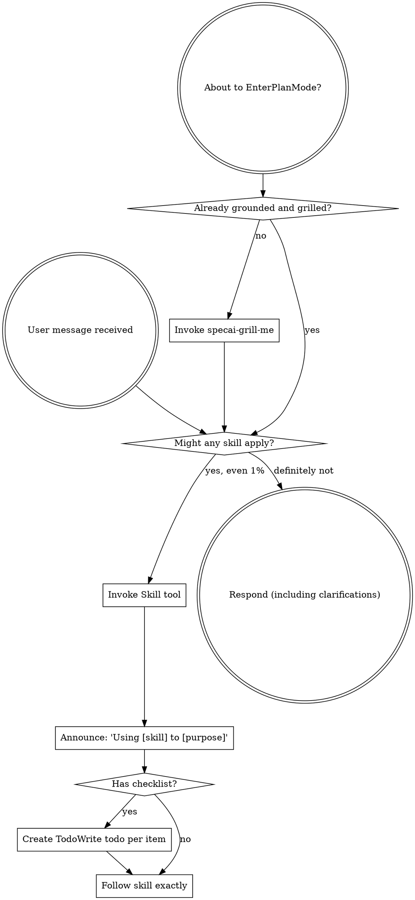

<SUBAGENT-STOP>
If you were dispatched as a subagent to execute a specific task, skip this skill.
</SUBAGENT-STOP>

<EXTREMELY-IMPORTANT>
If you think there is even a 1% chance a skill might apply to what you are doing, you ABSOLUTELY MUST invoke the skill.

IF A SKILL APPLIES TO YOUR TASK, YOU DO NOT HAVE A CHOICE. YOU MUST USE IT.

This is not negotiable. This is not optional. You cannot rationalize your way out of this.
</EXTREMELY-IMPORTANT>

## Shared Six-Artifact Contract

Full and Mini modes use the same six feature artifacts:

- `prd.md` — product requirements
- `spec.md` — functional contract
- `designs.md` — approved design and architecture
- `plan.md` — implementation plan and execution log
- `tasks.md` — atomic task list
- `verify.md` — global acceptance criteria and evidence

Mini is compact by content density and shorter ceremony only. It still
preserves exact task instructions, global `Given / When / Then` criteria,
criterion metadata, evidence, the corrective loop, branch timing, and Gate UA.

## Documentation Gates (INQUEBRANTABLE)

**For specai-mini and specai-plan, all six feature artifacts are IMPRESCINDIBLE. No implementation starts without them. This is a HARD GATE — no exceptions, no shortcuts.**

The required files BEFORE any code is written are the six artifacts above.

**If any of these files don't exist: STOP. Do NOT write code. Do NOT create files. Do NOT proceed.**

The flow is: grill-me with codebase grounding → all six feature artifacts exist → explicit implement/backlog choice → branch only for implementation → implementation. No docs = no implementation. Period.

This applies to BOTH specai-mini and specai-plan. Full mode creates six feature
artifacts; Mini uses the same six artifacts in compact form, with shorter
ceremony while retaining the complete execution and acceptance contract.

## Instruction Priority

specai skills override default system prompt behavior, but **user instructions always take precedence**:

1. **User's explicit instructions** (CLAUDE.md, GEMINI.md, AGENTS.md, direct requests) — highest priority
2. **specai skills** — override default system behavior where they conflict
3. **Default system prompt** — lowest priority

If CLAUDE.md, GEMINI.md, or AGENTS.md says "don't use TDD" and a skill says "always use TDD," follow the user's instructions. The user is in control.

## How to Access Skills

**In Claude Code:** Use the `Skill` tool. When you invoke a skill, its content is loaded and presented to you—follow it directly. Never use the Read tool on skill files.

**In Copilot CLI:** Use the `skill` tool. Skills are auto-discovered from installed plugins. The `skill` tool works the same as Claude Code's `Skill` tool.

**In Gemini CLI:** Skills activate via the `activate_skill` tool. Gemini loads skill metadata at session start and activates the full content on demand.

**In other environments:** Check your platform's documentation for how skills are loaded.

## Platform Adaptation

Skills use Claude Code tool names. Non-CC platforms: see `references/copilot-tools.md` (Copilot CLI), `references/codex-tools.md` (Codex) for tool equivalents. Gemini CLI users get the tool mapping loaded automatically via GEMINI.md.

### Codex dispatch guard

On Codex, read `references/codex-tools.md` before dispatching any subagent.
Every SpecAI dispatch uses `fork_context: false`; a forked conversation is
never an acceptable fallback. The handoff starts with `/specai-plan` (or
`/specai-mini`) and contains only the bounded context listed in that mapping.
When `wait_agent` returns `timed_out: true`, poll the same handle again; it is
not a terminal result and must not be treated as failure.

# Using Skills

## The Rule

**Invoke relevant or requested skills BEFORE any response or action.** Even a 1% chance a skill might apply means that you should invoke the skill to check. If an invoked skill turns out to be wrong for the situation, you don't need to use it.

## Red Flags

These thoughts mean STOP—you're rationalizing:

| Thought | Reality |
|---------|---------|
| "This is just a simple question" | Questions are tasks. Check for skills. |
| "I need more context first" | Skill check comes BEFORE clarifying questions. |
| "Let me explore the codebase first" | Skills tell you HOW to explore. Check first. |
| "I can check git/files quickly" | Files lack conversation context. Check for skills. |
| "Let me gather information first" | Skills tell you HOW to gather information. |
| "This doesn't need a formal skill" | If a skill exists, use it. |
| "I remember this skill" | Skills evolve. Read current version. |
| "This doesn't count as a task" | Action = task. Check for skills. |
| "The skill is overkill" | Simple things become complex. Use it. |
| "I'll just do this one thing first" | Check BEFORE doing anything. |
| "This feels productive" | Undisciplined action wastes time. Skills prevent this. |
| "I know what that means" | Knowing the concept ≠ using the skill. Invoke it. |

## Skill Priority

When multiple skills could apply, use this order:

1. **Process skills first** (grill-me, debugging) - these determine HOW to approach the task
2. **Implementation skills second** (frontend-design, mcp-builder) - these guide execution

"Let's build X" → grill-me first, then implementation skills.
"Fix this bug" → debugging first, then domain-specific skills.

## Skill Types

**Rigid** (TDD, debugging): Follow exactly. Don't adapt away discipline.

**Flexible** (patterns): Adapt principles to context.

The skill itself tells you which.

## User Instructions

Instructions say WHAT, not HOW. "Add X" or "Fix Y" doesn't mean skip workflows.
