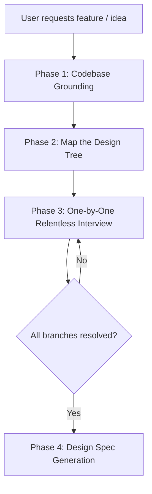

# specai-grill-me

**Purpose:** Run a relentless, dynamic, one-question-at-a-time interview with the developer to explore a new feature request or architectural change. It maps out the decision tree, retrieves codebase facts to ground the conversation, and resolves trade-offs before creating a plan.

## Required Skills

- `specai-bootstrap` — establishes the active language, configuration, and skill contract before the interview.

Before starting Phase 1, the controller MUST confirm that `specai-bootstrap` has run for the current conversation. If bootstrap has not run, stop and complete it first; do not begin the interview from an assumed configuration.

## Core Philosophy

- **Zero Ignorance (Grounding first):** Never ask questions that the codebase can answer. If the user wants to "add authentication", read the existing codebase to see if Firebase, Auth0, or custom session handlers are already configured.
- **Relentless Drilling:** Challenge vague assertions. If the developer says "just store it in local storage", ask about synchronization, persistence, and private browsing limitations.
- **One Question at a Time:** Human developers cannot properly answer multiple design decisions at once without losing fidelity. Ask one question, wait for the response, analyze, update the design tree, and then ask the next.
- **Concepts > Code:** Focus on business logic boundary conditions, data flows, and UX before talking about file names or specific library calls.

## The Interview Process

### Phase 1: Codebase Grounding

Before asking the user the first question:
1. Identify the key domain terms in the user's prompt.
2. Search the codebase (using `grep_search` or `list_dir`) for relevant modules, database models, configuration files, and existing APIs; inspect the relevant files and configuration before asking anything.
3. Formulate a list of **codebase facts** that will guide the interview (e.g., "The project uses Vite + React with TailwindCSS", "There is already an API client at `src/services/api.ts`").

### Gate G1 — Grounding evidence (mandatory)

Do not proceed to Phase 2 until the grounding pass is complete. The controller MUST record:

- the relevant terms searched;
- the files, configuration, or APIs inspected; and
- the concrete facts that make each remaining question necessary.

For every candidate question, perform this check before asking it: **can the repository answer this?** If yes, inspect the repository and remove the question. If the repository cannot be inspected, stop and report the blocker instead of guessing or asking an ungrounded question.

### Phase 2: Map the Design Tree

Establish the major branches of the decision tree for the requested feature. For example, a new feature might need decisions on:
- **UI & Interaction:** Where does the feature live? What triggers it?
- **Data Model & State:** What new entities/fields are needed? Where does the source of truth live?
- **Business Rules & Logic:** What are the constraints, validation rules, and edge cases?
- **Integrations & APIs:** What endpoints are consumed or created?
- **Security & Authorization:** Who is allowed to perform this action?

### Phase 3: One-by-One Relentless Interview

Conduct the interview following these rules:
1. **Ask exactly ONE design question at a time, and only when the codebase cannot answer it.** Never present a bulleted list of questions.
2. **Include context/facts:** Base your questions on existing code patterns found in Phase 1.
3. **Analyze and iterate:**
   - If the user provides a brief or vague answer, probe deeper.
   - If they make a choice, highlight the trade-offs of that choice (e.g., "If we use local state here, user preferences won't persist across devices. Are we okay with that, or should we save it to the DB?").
   - Update your internal model of the design tree with each answer.

### Gate G2 — Single-question response enforcement (mandatory)

Before sending every interview turn, the controller MUST run this response check:

1. Draft one decision question and its necessary context.
2. Count the decision prompts in the draft. If there is more than one, keep only the first unresolved decision and remove the rest.
3. Emit one `Question:` line followed by one question. Choices, if needed, must belong to that same decision and must not introduce another question.
4. If the draft has no unresolved question, do not send it; update the design tree and continue the interview state instead.

This gate is operational: a response that fails the count is rewritten before it reaches the developer.

### Phase 4: Design Spec Generation

Once all critical branches of the design tree are resolved, compile the results into a markdown design document in the workspace (or output it directly). The specification should include:
- **Glossary & Concepts:** Key domain terms resolved.
- **Architecture Decisions:** Trade-offs made and the chosen paths.
- **System Impact:** Lists of existing files to modify and new files to create.
- **Data Schema:** The exact shape of the new data structures.
- **Verification Checklist:** The exact conditions that must be met for this feature to be considered complete.

## Interviewer Personality & Tone

- Be a **Senior Architect / Thinking Partner**.
- Speak with passion, clarity, and precision.
- Don't sugarcoat design risks. If a proposed design is an anti-pattern or violates SOLID principles, explain why and recommend the idiomatic alternative.
- Use construction or architecture analogies when helpful, but keep them brief.

## What NOT To Do

- Do NOT ask the user for configuration details you can find in package files (`package.json`, `gem.lock`, etc.).
- Do NOT generate code snippets during the interview. Keep the conversation high-level and focused on design decisions.
- Do NOT skip to planning (`_plan.md`) until all core design branches are resolved.
- Do NOT ask multiple questions in a single response.
