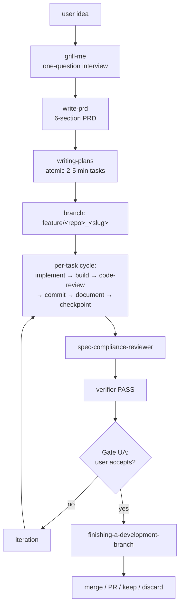

# specai-help

The 30-second orientation to specai. **Read-only.** Does not modify anything. Print the compact guide and a Mermaid of the flow.

## ABSOLUTE RULE (INQUEBRANTABLE)

**Always print the same canonical layout.** The user's "where do I start?" question deserves a stable answer, not a creative one.

## What to print

```
═══════════════════════════════════════════════════════════════
  SpecAI  v1.0
═══════════════════════════════════════════════════════════════

📍 Docs: https://github.com/ArceApps/specai
📍 Audit findings: docs/specai/audit-findings.md
📍 Full comparison: docs/COMPARISON.md
📍 Failure modes: docs/FAILURE-MODES.md

FLOW (Mermaid):
───────────────────────────────────────────────────────
[socratic + grill-me + write-prd diagram here]
───────────────────────────────────────────────────────

COMMANDS (slash):
  /specai-plan         Full flow (new feature / refactor)
  /specai-mini         Small flow (one-line fix / small feature)
  /specai-explore      Read code, no commits
  /specai-verify       Run verifier on existing plan
  /specai-review       Diff-level anti-bloat
  /specai-iterate      User feedback loop
  /specai-mode         Set senior philosophy intensity
  /specai-audit        Repo-wide bloat audit
  /specai-audit-plan   Full audit + interactive triage + handoff
  /specai-backlog      Pick pending plan from backlog
  /specai-init         First-run setup
  /specai-finish       Preflight, document and archive a completed feature
  /specai-onboarding   Validate setup + walk through first plan
  /specai-status       "Where am I?" at any time
  /specai-help         This guide
  /specai-config       Configure models / language

SKILLS BY TYPE:
  Process (rigid):
    specai-bootstrap, specai-grill-me, specai-write-prd,
    specai-writing-plans, specai-subagent-driven-development,
    specai-verification-before-completion,
    specai-finishing-a-development-branch, specai-iteration,
    specai-senior-philosophy, specai-systematic-debugging,
    specai-test-driven-development, specai-checkpoints,
    specai-using-git-worktrees, specai-code-review,
    specai-command, specai-documentation
  Meta (flexible):
    specai-anti-bloat, specai-domain-modeling,
    specai-living-documents, specai-improve-codebase-architecture,
    specai-antigravity-bridge, specai-dispatching-parallel-agents,
    specai-receiving-code-review, specai-requesting-code-review,
    specai-writing-skills, specai-agent-clarification,
    specai-agent-models, specai-judgment-day,
    specai-audit-plan
  User-facing:
    specai-onboarding, specai-status, specai-which,
    specai-help (this), specai-evals, specai-backlog

THE ONE RULE TO REMEMBER:
  Tasks DONE ≠ plan DONE ≠ user-accepted.
  Implementation completes when the user explicitly accepts.

═══════════════════════════════════════════════════════════════
```

## The Mermaid diagram to embed



## Boundaries

**This skill does:**
- Print the canonical guide above
- Embed the Mermaid flow
- Link to GitHub and the comparison/failure-mode docs

**This skill does NOT:**
- Run any flow
- Dispatch any subagent
- Modify anything

## When to use

- User asks "what is specai?"
- User asks "how do I start?"
- User asks "where do I find X?"
- User says "help" with no other context.

## Cross-references

- `AGENTS.md` — entry-point rules
- `README.md` — installation and quick start
- `docs/COMPARISON.md` — alternative tools and trade-offs
- `docs/FAILURE-MODES.md` — common failure modes with recovery
- `docs/specai/audit-findings.md` — current audit's own findings
- `skills/specai-onboarding/SKILL.md` — first-run guide (with smoke-test)
- `skills/specai-status/SKILL.md` — at-a-glance flow state
