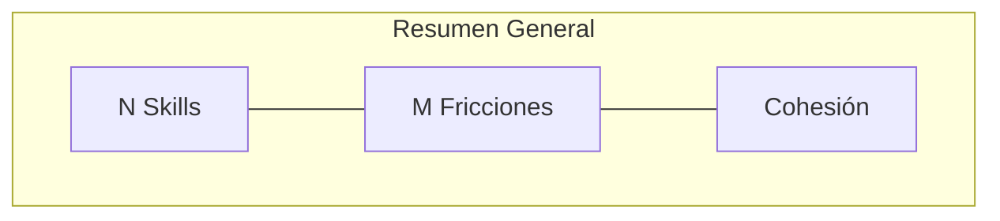
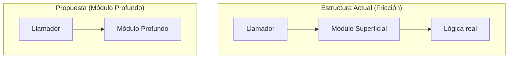

# specai-improve-codebase-architecture

Use this skill when auditing or analyzing the architectural design of a codebase to find friction points, shallow modules, lack of locality, and seam leakage.

## Core Principles

When scanning the codebase, analyze the structure using the following design principles:

1. **Deep vs. Shallow Modules**:
   - **Deep Modules**: Modules that provide powerful functionality through a simple, clean interface. These are highly desirable because they hide complexity.
   - **Shallow Modules**: Modules that do very little real work relative to the size and complexity of their interface. Examples include simple wrapper functions/classes that only delegate to another function/class, or directories with single-line files that increase cognitive load without adding value.

2. **Locality & Cohesion**:
   - **Lack of Locality**: Situations where a single logical change requires modifying multiple distant files (e.g., adding a database field requires changing the model, the router, the DTO, the validator, and the UI component).
   - **High Locality**: Changes are self-contained. Closely related details live together.

3. **Information Hiding & Seam Leakage**:
   - **Seam Leakage**: Modules exposing their internal implementation details (e.g., exposing raw database queries, internal configuration structures, or implementation-specific types) instead of presenting a stable, generic abstraction.
   - **Information Hiding**: A module's interface should not reveal details about how the module is implemented, allowing the implementation to change without affecting callers.

---

## Audit Workflow

### Step 1: Scan and Analyze
Perform an organic scan of the codebase. Examine the main entry points, the folder structure, the division of responsibilities, and how modules communicate. Look for:
- Over-divided or bloated packages/folders.
- Classes or modules that act as thin wrappers (shallow).
- Files requiring parallel edits for minor features (lack of locality).
- Internal details that leak into caller files (seam leakage).

### Step 2: Generate the Recommendations
For each identified friction point:
- Formulate a clear, actionable improvement proposal.
- Structure it as a "Before" (current state) and "After" (proposed state) design.
- Define a Mermaid.js diagram depicting both states.

### Step 3: Write the Markdown Report
Write a standalone Markdown file inside the active `docs/specai/` or temporary directory:
- **Path**: `docs/specai/architecture-audit-report.md` (or temporary `specai-architecture-report.md`).
- **Diagrams**: Embed native Mermaid.js code blocks (` ```mermaid `) depicting "Before" (Friction) and "After" (Proposed) flows side-by-side or stacked.
- **Visuals**: Use standard markdown alerts (e.g., `> [!TIP]`, `> [!WARNING]`) to highlight recommendations.

### Step 4: Instruct the User to View the Report
Once written, present the file link to the user and instruct them to:
1. Open the `.md` file in their editor.
2. Press **Ctrl + Shift + V** (or Cmd + Shift + V on macOS, or click the Markdown Preview button in the editor) to render the formatted text and interactive Mermaid diagrams directly.

---

## Markdown Report Template

Use the following template when generating the audit report:

```markdown
# specai — Reporte de Auditoría Arquitectónica

> [!TIP]
> Para ver este reporte de forma visual e interactiva dentro de tu editor, presioná **Ctrl + Shift + V** (o hacé clic en el botón de Vista Previa de Markdown de tu editor).

---

## Resumen de Salud del Codebase

El análisis del repositorio `specai` muestra la estructura y diseño modular.



---

## Oportunidades y Fricciones de Diseño

### 1. [Nombre de la Fricción]
*   **Componentes**: `ruta/al/componente-1` y `ruta/al/componente-2`
*   **Severidad**: [Baja/Media/Alta]
*   **Problema**: [Descripción corta de la fricción y cómo impacta el mantenimiento].

#### Esquema de Refactorización:
[Propuesta arquitectónica de mejora].


```
