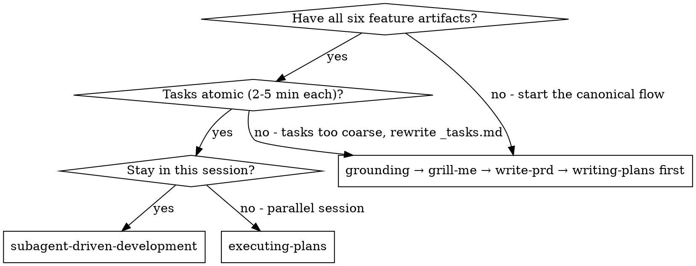
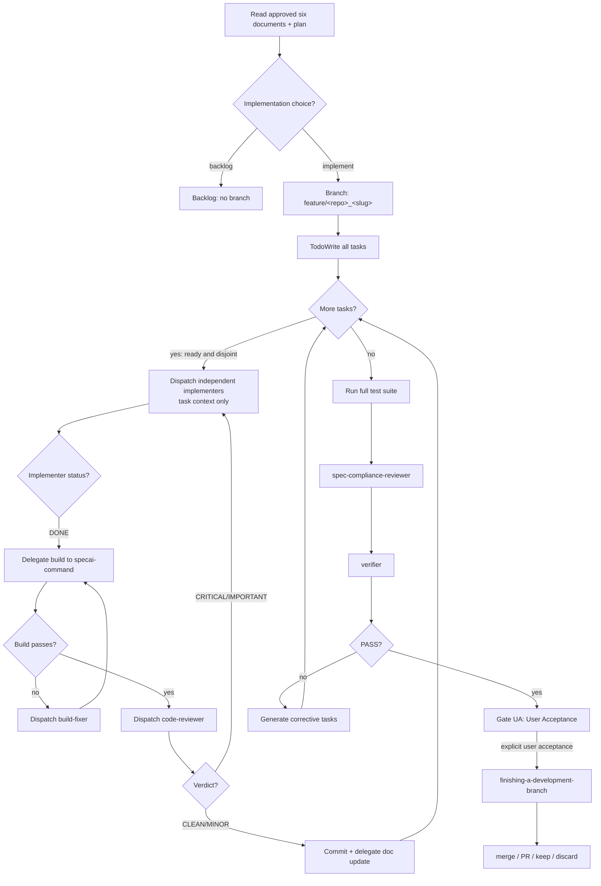

# Subagent-Driven Development (specai)

Execute a plan by dispatching specialized subagents per task, with **specai-documentation** maintaining the live plan, a **build-fixer** handling compilation errors, a **code-reviewer** checking per-task quality before commit, a **spec-compliance-reviewer** validating the full implementation, and a **verifier** checking the final result against acceptance criteria. After the approved PRD and implementation choice, create the feature branch only after the user chooses implementation. Each task passes build, tests, and code review before commit, and its state is recorded in the living documents.

Full and Mini modes use the same six feature artifacts: `prd.md`, `spec.md`,
`designs.md`, `plan.md`, `tasks.md`, and `verify.md`. Mini is compact by
content density and shorter ceremony only; exact task instructions, global
`Given / When / Then` criteria, criterion metadata, evidence, the corrective
loop, branch timing, and Gate UA remain required.

## Absolute Gates (INQUEBRANTABLE — Per-Task Cycle)

**The per-task cycle is RÍGIDO. NEVER skip, bundle, or reorder steps. Ready tasks may execute in parallel waves when isolation rules allow it; each task's commit and documentation remain serialized.**

| Gate | Step | PROHIBITED |
|------|------|-----------|
| **Gate S0** | All six feature artifacts (`prd.md`, `spec.md`, `designs.md`, `plan.md`, `tasks.md`, and `verify.md`) exist with complete content | Starting execution without all six artifacts |
| **Gate S1** | Approved implementation choice → create feature branch before code | Writing implementation files on `main`/`master`/`develop`/`dev`, or creating a branch before the implementation choice |
| **Gate S2** | Read plan once, extract all tasks, create TodoWrite | Dispatching implementers without understanding full plan structure |
| **Gate S2.5** | Parse task metadata (Complexity, Risk). Halt and request interactive approval if Complexity >= 7 or Risk is High. | Skipping risk validation, or executing high-complexity/high-risk tasks without interactive approval. |
| **Gate S3** | Dispatch implementer with ONLY its task and its persisted `Research & Context` | Providing full plan, other tasks, or execution log to implementer; omitting research context. |
| **Gate S4** | Implementer reports DONE → verify build passes | Moving to next task while build is broken |
| **Gate S5** | Build passes → dispatch code-reviewer (MANDATORY) | Skipping code review, committing unreviewed code |
| **Gate S5.5** | Code reviewer says quality CLEAN and `Compliance verdict: PASS` → serialized commit → serialized documenter handoff | Skipping task compliance, commit, or documenter |
| **Gate S5.8** | Code reviewer finds CRITICAL/IMPORTANT → fix → re-verify build → re-review | Proceeding with unfixed issues, or skipping re-review after fix |
| **Gate S6** | All tasks done → full test suite → spec-compliance-reviewer → verifier | Skipping spec compliance review before verifier, declaring done before verifier says PASS |

**If any step within a task fails, stop that task and resolve it. Other independent tasks in the same wave may continue only when their workspaces, files, and shared resources remain disjoint.**

## Critical Delegation Rules

**All subagents must follow these rules. They are not optional:**

1. **No subagent may execute commands directly.** Any shell command (build, test, git, lint, etc.) MUST be delegated to `specai-command`.
2. **No subagent may write documentation directly.** Any documentation file (plan, tasks, design docs, specs, README, etc.) MUST be delegated to `specai-documentation`.

These rules apply to: `implementer` (except verification commands), `build-fixer`, `verifier`, `code-reviewer`, and `spec-compliance-reviewer`.

The only agents allowed to execute commands are `specai-command` (all commands), `implementer` (build/test verification only), and the **controller** (you). The only agent allowed to write documentation is `specai-documentation`.

## Task State Contract

The canonical format lives in `skills/specai-writing-plans/SKILL.md` and its living-document ownership rule in `skills/specai-living-documents/SKILL.md`. This flow applies it at task level with the transition `pending` → `in_progress` → `completed`:

- TodoWrite y documentación se actualizan en el mismo evento: this is one logical atomic transition in which the controller updates TodoWrite and, within the same serialized event, notifies `specai-documentation`, which writes the matching task documentation. No other agent writes those files, and the controller never applies documentation edits.
- At task start, move the todo and task block through `pending` → `in_progress`; `Completed: [ ]` permanece until terminal verification. Keep `in_progress` through implementation, build, tests, review, and corrective loops.
- Ready, independent tasks may be `in_progress` in parallel when their workspaces and writes are disjoint. varias tareas pueden estar `in_progress` when isolated. Never run two implementers in the same workspace or against shared resources.
- Only after build/tests, code review, and commit succeed does the controller emit the terminal completion event; the documenter then changes `Status` a `completed` and `Completed` a `[x]`.
- Implementation, build, tests, and review may run in parallel inside a wave only when workspaces, files, and shared resources are disjoint; commits y documentación are serialized, including all task-state transitions; no transition queda `fuera del serializador`. Los pasos internos no se marcan.

Before dispatching implementation, the documenter records `TASK_STARTED` in the plan `Execution Log` with `timestamp`, `branch`, `git_hash`, `task_id`, and context. On a new session, recover every `Status: in_progress` task from `*-tasks.md` and its matching log entry; if none are active, select the first eligible `pending` task. Inconsistencies block execution. TodoWrite is rebuilt as a session mirror and is never persistent authority.

### Canonical Scheduling Handoff

Every lifecycle handoff (`TASK_STARTED`, `TASK_UPDATE`, `IMPLEMENTER_RESULT`, `TASK_FAILED`, and `TASK_COMPLETED`) MUST carry these fields copied from the task definition:

```text
Workspace: <exact workspace/worktree identifier>
Shared Resources: <concrete shared files/services/locks, or none>
Wave: <stable wave identifier>
Depends On: <task IDs, or none>
```

`Depends On` determines readiness; `Wave` groups tasks after their dependencies are resolved. A wave is executable in parallel only when every task is marked parallelizable, no task requires solo execution, workspaces are isolated and distinct, and `Shared Resources` do not overlap. Missing, unknown, or conflicting scheduling fields force sequential execution. The controller preserves these fields unchanged in every documenter handoff.

## Goal closure and corrective loop

Task completion is not goal completion. A task may be `completed` after its own
build, review, and commit while the final verifier still finds a missing edge
case or an unmet cross-task requirement. The only valid completion condition is
the invariant declared in `<spec-name>-verify.md`:

```text
GOAL_COMPLETE iff every criterion is `PASS`, every task is `completed`, no corrective task is open, and the latest evidence belongs to the current `HEAD`.
```

After the final test suite and spec-compliance review, the verifier checks every
criterion, every task state, the coverage matrix, and evidence freshness. If
the result is `FAIL`, `PARTIAL`, or `UNVERIFIED`, the controller MUST:

1. Keep the goal status open; do not enter Gate UA.
2. Send each failed criterion to `specai-documentation` as a **Corrective Task**
   under `## Corrective Tasks`, with `Corrective Of`, criterion ID, exact file,
   target, location, current value, change, assertion, command, expected result,
   and evidence of the failure.
3. Re-dispatch the implementer with that corrective task only. The implementer
   does not receive the whole plan or verifier transcript.
4. Repeat build/test, code review, commit, and documentation for the corrective
   task, then re-run the affected criteria and the regression suite.
5. Invoke the verifier again against the new `HEAD`.

Gate UA is reachable only when the verifier reports `PASS` and the complete
`GOAL_COMPLETE` invariant is true. A green task checkbox alone never bypasses
this loop.

## OpenCode Agent Configuration

This skill requires dedicated subagents configured in OpenCode. Create them with:
```bash
bash scripts/setup-agents.sh
```

**Models are configurable** in `~/.config/specai/config.json` — see [specai:specai-agent-models] for details.

**Dispatch with delegate:** Use `delegate(prompt=[prompt_text], agent="<name>")`. OpenCode resolves the model from the agent config.

**Why subagents:** You delegate tasks to specialized agents with isolated context. By precisely crafting their instructions and context, you ensure they stay focused and succeed at their task. **Each implementer receives ONLY its own task** — no plan, no other tasks, no execution log. This minimizes context and maximizes focus.

**Core principle:** Atomic task + minimal context + specialized subagent per role = high quality, fast iteration, predictable execution.

**Continuous execution:** Group ready independent tasks into parallel waves. Do not pause to check in with the user between waves, **EXCEPT** when a task has a human checkpoint triggered by its complexity (Complexity >= 7) or high risk (Risk = High). Otherwise, execute all waves from the plan without stopping. The only reasons to stop are: BLOCKED status you cannot resolve, ambiguity that genuinely prevents progress, or all tasks complete. The user reviews the result at Gate UA; `finishing-a-development-branch` is unavailable until explicit acceptance.

## When to Use



**vs. Executing Plans (parallel session):**
- Same session (no context switch)
- Fresh specialized subagent per task (no context pollution)
- Live documentation via the documenter subagent
- Build errors handled by a dedicated subagent, not the implementer
- Each task commits when build passes and tests pass

## The Process



The five non-obvious rules this diagram enforces:
1. Implementer dispatches get **task-context only** — never the full plan or execution log.
2. Ready independent tasks may run in parallel only with disjoint workspaces and writes; two implementers may never share a workspace or resource.
3. After every successful task: commit + documenter handoff in that order, no shortcuts; these operations are serialized.
4. Build failure → build-fixer, NOT implementer. Build-fixer has minimal-diff as its only job.
5. Code-reviewer is read-only. Fixes come from the orchestrator (atomic) or by re-dispatching the implementer.
6. **Gate UA** blocks `finishing-a-development-branch`. Without user acceptance, no merge.

```

## Backlog Integration

Before dispatching the first task, if the current plan was started from backlog:
1. Find the entry by matching `plan_dir`
2. Run `bash scripts/backlog.sh update-status <id> in-progress`
3. Run `bash scripts/backlog.sh update-branch <id> $(git branch --show-current)`

## Subagent Roles

| Agent | Role | Context it receives |
|-------|------|---------------------|
| `implementer` | Implement ONE atomic task | Only its task (title, spec section, files, acceptance) |
| `build-fixer` | Fix compilation/build errors with minimal diff | The error log + the relevant code |
| `code-reviewer` | Per-task code quality and local compliance review (MANDATORY, before commit) | Task diff, tech stack, task requirements |
| `verifier` | Compare implementation against `_verify.md` acceptance criteria | The plan, the code, the execution log |
| `spec-compliance-reviewer` | Spec compliance review after all tasks (MANDATORY, before verifier) | Full implementation diff, plan, all tasks |
| `specai-command` | Execute shell commands (build, test, git, etc.) | The exact command to run + working directory |
| `specai-documentation` | Create/update documentation sections | Extracted section text + what to add/change |

**Delegation:** All agents (except `specai-command`, `implementer` for verification, and `specai-documentation`) MUST delegate command execution to `specai-command` and documentation writing to `specai-documentation`. `implementer` may run build/test commands to verify its own work. No agent other than `specai-documentation` may write documentation files.

## Model Selection (OpenCode)

specai uses dedicated agents with configurable models per role. Current models are read from `~/.config/specai/config.json` at session start:

| Agent | Role | Default model |
|-------|------|---------------|
| `implementer` | Atomic task implementation | `minimax/MiniMax-M3` |
| `build-fixer` | Compilation error resolution | `minimax/MiniMax-M3` |
| `code-reviewer` | Per-task code quality and local compliance review | Configured in roster/config |
| `verifier` | Acceptance criteria verification | `minimax/MiniMax-M3` |
| `spec-compliance-reviewer` | Spec compliance and global invariant review (all tasks) | Configured in roster/config |
| `specai-command` | Command execution | `minimax/MiniMax-M3` |
| `specai-documentation` | Documentation management | `minimax/MiniMax-M3` |

**Change models at any time** with:
- `specai-configure-model` tool in conversation
- `bash scripts/configure-agents.sh <agent> <model>` in terminal
- Edit `~/.config/specai/config.json` directly

## Command Caching Strategy

`specai-command` supports build-result caching via `cache_watch` + `cache_key`. Saves ~30-50% tokens on tasks that only modify tests. See `scripts/lib-cache.md` (TODO) for the controller pseudocode; the rule is simple: if `task.changes_only_tests` and you have a stored `build_hash`, pass `cache_key: <hash>` and skip the rebuild if `CACHED`.

## Context Discipline

**The most important rule:** Each subagent receives ONLY the context it needs.

### Codex dispatch invariant

Every subagent in this skill is dispatched in a fresh session with
`fork_context: false`. A forked controller conversation is forbidden because
it can multiply the input context into millions of tokens. The first non-empty
line of a full-flow handoff is `/specai-plan`; the first line for Mini mode is
`/specai-mini`.

The handoff allowlist is: role, one task or lifecycle event, exact target
paths, the relevant section, the concrete change contract, acceptance criteria,
required research facts, and `Workspace`, `Shared Resources`, `Wave`, and
`Depends On`. Never include the parent transcript, the complete plan or task
list, unrelated task entries, previous tool output, or unrelated skill text.
If an independent session cannot be created, stop with `BLOCKED` rather than
dispatching with inherited context.

When waiting for a spawned agent, `timed_out: true` is only the end of the
current polling interval. Keep the same handle and poll again; do not cancel,
retry, or mark the task failed until a terminal agent status exists.

### Codex bounded lifecycle

Preflight `multi_agent = true`; otherwise return `TASK_BLOCKED` — inline
execution and silent fallback are forbidden. Every handoff carries `Max Runtime:
900 seconds`, `Deadline: 900 seconds`, `Heartbeat every 30 seconds`, and a
15-second poll interval. Keep the same handle across non-terminal polls. At
deadline, call `cancel_agent`, record `TASK_FAILED` with `deadline_exceeded`,
close the terminal handle, and never relaunch with inherited context.

### For the implementer:
- DO NOT paste the full plan
- DO NOT paste the execution log
- DO NOT paste the full `_tasks.md` file
- DO NOT paste other tasks (only the current task)
- DO NOT let the implementer read the plan file or tasks file

The implementer's prompt contains:
1. Task title
2. Task description (self-contained, atomic action)
3. Acceptance criteria for this task
4. Files to touch
5. Minimal spec context (only the section needed)
6. Architectural notes that are not obvious
7. Persisted `Research & Context` (if defined in the task checklist)

### For the documenter:
- DO NOT send the full `_plan.md` or `_tasks.md` files
- Send only the relevant event, target paths, section context, and requested change
- The documenter reads and writes the named documentation files directly
- The controller (you) only notifies the documenter and never applies the change with `edit` or `write`

The controller (you) reads the plan ONCE at the start, extracts all tasks, and dispatches each ready set as a parallel wave when isolation permits. After each relevant event, the controller notifies the documenter; the documenter reads and writes the target documentation directly. The controller never applies documentation edits. Commit and documentation handoffs are serialized within and between waves; session metadata remains ephemeral.

## Branch & Commit Discipline

This skill's branch + commit rules are *the same* as the global rules in `AGENTS.md` §Commit Rules. Read those once; the orchestrator enforces them on every task. Key reminders:

- **Hard rule:** create the feature branch only after PRD approval and the user's explicit choice to implement; backlog remains branchless. Never write implementation files or commit directly on `main` / `master` / `develop` / `dev`.
- **Per-task commits.** Each successful build+test cycle = one commit. Use `bash scripts/specai-command <commit-msg>`.
- **Commit mode** is in `~/.config/specai/config.json` (`auto` / `confirm` / `manual`). Default: `auto`. Respect it.
- **Forbidden:** bundling multiple tasks into one commit. Each commit carries one task's diff.

## Handling Subagent Status

### Implementer

- **DONE** — proceed to build verification
- **DONE_WITH_CONCERNS** — read concerns; address if about correctness, otherwise proceed
- **NEEDS_CONTEXT** — provide more context, re-dispatch
- **BLOCKED** — assess: context problem, model problem, task too large, or plan wrong

### Build-Fixer

- **FIXED** — re-run build to verify, proceed to documenter
- **NEEDS_HUMAN** — design decision only the user can make; pause and ask
- **NEEDS_ORIGINAL_IMPLEMENTER** — needs intent of the code; re-dispatch to implementer

### Documenter

- **OK** — files updated cleanly, progress status reported; proceed to next task
- **OK_WITH_CONCERNS** — updated, noted structural issues; review concerns, proceed
- **BLOCKED** — could not update (plan file missing, etc.); resolve before continuing

### Verifier

| Verifier result | Next gate |
|-----------------|-----------|
| **PASS** | **Gate UA only; wait for explicit user acceptance before finishing** |
| **FAIL** | Generate corrective tasks and re-enter the per-task loop |
| **Any other result** | **Not a valid terminal verdict: STOP and resolve or re-enter the corrective-task loop; do not enter Gate UA or finishing** |

### Code-Reviewer (Per-Task)

- **Quality CLEAN + Compliance PASS** — proceed to commit
- **Compliance FAIL** — create a concrete corrective task and keep the task open
- **CRITICAL** — bugs, security, data loss; MUST fix before commit. Orchestrator decides: atomic fix (≤10 lines, 1 file) → fix directly; complex → dispatch implementer → re-run build+tests → re-dispatch code-reviewer
- **IMPORTANT** — architecture, error handling, test gaps; SHOULD fix before next task. Same decision tree as CRITICAL
- **MINOR** — style, naming, optimizations; document for backlog, proceed to commit

### Spec-Compliance-Reviewer (End-of-Flow)

- **PASS** — proceed to verifier
- **FAIL** — generate corrective tasks in `_tasks.md`, re-enter the per-task loop

**Never** ignore an escalation. If a subagent says it's stuck, something needs to change.

## Trace (Token Metrics)

Pass `trace: true` to `specai-command` to get token metrics per call. Use sparingly — trace itself costs tokens.

## Documentary recovery

The documentary recovery source is the combination of `*-tasks.md` statuses and the `Execution Log` of `*-plan.md`. Before implementation, record `TASK_STARTED` with `timestamp`, `branch`, `git_hash`, `task_id`, and context. Recover every `in_progress` task; when none is active, select the first eligible `pending` task. Block on inconsistencies. TodoWrite is only the session mirror, and session metadata remains ephemeral rather than being written to the checkout.

## Prompt Templates

Use these with `delegate(prompt=[template_content], agent="<agent_name>")`:

- `./implementer-prompt.md` — Atomic task with minimal context
- `./documenter-prompt.md` — Live plan maintenance (dispatched as `specai-documentation`)
- `./build-fixer-prompt.md` — Compilation error resolution
- `./verifier-prompt.md` — Acceptance criteria verification
- `../specai-code-review/code-reviewer-prompt.md` — Per-task code quality review
- `../specai-code-review/spec-compliance-reviewer-prompt.md` — End-of-flow spec compliance review

## Example Workflow

> A complete worked example with one happy task, one error-recovery, and the end-of-flow is preserved at `tests/subagent-driven-dev/svelte-todo/` and `tests/subagent-driven-dev/go-fractals/`. Below is the canonical happy-path.

```
You: I'm using Subagent-Driven Development to execute this plan.

# Boot
[delegate("git remote get-url origin", agent="specai-command")]
[delegate("git checkout -b feature/<repo>_<feature>", agent="specai-command")]

# Read plan, build TodoWrite, dispatch Task 1
[delegate(<task-1-context-only>, agent="implementer")]
Implementer: "DONE. [build ✅] [tests 5/5 ✅]"
[delegate(<commit-msg>, agent="specai-command")]
[delegate(<task-completion-event-and-log-entry>, agent="specai-documentation")]

# Same loop for Tasks 2..N. If build fails on any task:
Implementer: "DONE_WITH_CONCERNS. Build error: tsc exit 2."
[delegate(<build-error-log + task-context>, agent="build-fixer")]
Build-fixer: "FIXED. Verification: npm run build"
[delegate("npm run build", agent="specai-command")]   # re-verify
# Then resume with the implementer for the same task.

# After all tasks done
[delegate("npm test", agent="specai-command")]         # full test suite
[delegate("verify <spec>-verify.md", agent="verifier")]   # spec-compliance-reviewer first, then verifier

# User-Acceptance Gate (added 2026-07-08)
[wait for user to test implementation and say "accepted"]
[Invoke specai-finishing-a-development-branch — only after explicit user acceptance]
[Skill presents: merge / PR / keep / discard]
```

## Advantages

**vs. Manual execution:**
- Subagents follow tasks precisely, no context drift
- Live plan via documenter gives full visibility without re-reading files
- Build errors handled by a specialist, not the implementer
- Full test suite runs at end to catch integration issues before verification
- Acceptance verification at the end is independent and rigorous
- Each commit is verified (build + tests pass) before being made

**vs. Executing Plans:**
- Same session (no handoff)
- Continuous progress (no waiting)
- Specialized subagents per role
- Live documentation as a side effect

**Quality gates:**
- Self-review by implementer
- Build verification (manual or via build-fixer)
- Code review by code-reviewer (per-task, MANDATORY: quality plus task compliance)
- Documenter ensures the plan reflects reality
- Spec compliance review after all tasks (MANDATORY, before verifier)
- Final verifier compares implementation to acceptance criteria
- Verification loop continues until all criteria pass

**Cost:**
- More subagent invocations per task
- `specai-command` adds 1-3 invocations per task (build, commit, tests)
- `code-reviewer` adds one invocation per task (code quality review)
- `specai-documentation` adds one invocation per task (doc updates)
- `specai-command` is also used for build-fixer re-verification
- Build-fixer adds invocations on errors
- `spec-compliance-reviewer` adds one invocation after all tasks
- Verifier adds one final invocation

## Red Flags

**Never:**
- Start implementation on `main` / `master` / `develop` / `dev` — a feature branch is mandatory, no exceptions, no opt-out
- Let any subagent (other than `specai-command` or `implementer` for verification) run shell commands directly
- Let any subagent (other than `specai-documentation`) write documentation files directly
- Apply grill-me questioning to deterministic agents (`specai-command`, `build-fixer`, `specai-documentation`) — they are input/output only
- Skip the verifier at the end
- Dispatch multiple implementer subagents in parallel only for ready tasks with disjoint workspaces and writes; never share a workspace or shared resource
- Make the implementer read the plan file (provide full text instead)
- **Pass full `_plan.md` or `_tasks.md` files to the documenter** — extract only the relevant section
- Skip scene-setting context for the implementer (it needs to understand where the task fits)
- Ignore subagent questions (answer before letting them proceed)
- Accept "close enough" on verification (verifier found issues = not done)
- Let the implementer try to fix build errors itself (delegate to `specai-command` first, then build-fixer)
- Move to the next task while the previous task's build is broken
- Make the verifier also be the implementer (separation of concerns)
- Skip code review because "it's simple" (simple code breaks too)
- Commit code that hasn't passed code-reviewer (CRITICAL/IMPORTANT issues unfixed)
- Skip spec-compliance-reviewer before the verifier
- Let the code-reviewer apply fixes (it's READ-ONLY, reports only)
- Proceed after CRITICAL/IMPORTANT review findings without fixing and re-reviewing

**If subagent asks questions:**
- Answer clearly and completely
- Provide additional context if needed
- Don't rush them into implementation

**If build-fixer escalates to the original implementer:**
- Re-dispatch the implementer with the build-fixer's analysis
- The implementer has the context of the task and can make a holistic fix

**If verifier finds failures:**
- Generate corrective tasks in `_tasks.md`
- Return to the per-task loop with those tasks
- Do not declare success until verifier says PASS

**If code-reviewer finds CRITICAL/IMPORTANT issues:**
- Orchestrator evaluates each issue: atomic fix (≤10 lines, 1 file, straightforward) → fix directly; complex → dispatch implementer
- After fix: re-run build+tests via `specai-command`, then re-dispatch code-reviewer
- Repeat until CLEAN or only MINOR issues remain
- Document every fix in `_plan.md` Execution Log

**If spec-compliance-reviewer finds issues:**
- Generate corrective tasks in `_tasks.md`
- Return to the per-task loop with those tasks
- Do not dispatch verifier until spec-compliance-reviewer says PASS

## Integration

**Required workflow skills:**
- **specai:specai-using-git-worktrees** — Ensures isolated workspace (creates one or verifies existing)
- **specai:specai-grill-me** — Grounds the request and resolves design ambiguity before `write-prd` and `writing-plans`
- **specai:specai-writing-plans** — Creates the six feature artifacts this skill executes
- **specai:specai-code-review** — Per-task code quality review + end-of-flow spec compliance review (MANDATORY)
- **specai:specai-finishing-a-development-branch** — Complete development only after explicit user acceptance at Gate UA; handle PR/merge workflow

**Subagents:**
- **specai:specai-command** — Subagent for executing shell commands (git, npm install, etc.)
- **specai:specai-documentation** — Subagent for ALL documentation (_plan.md, _tasks.md, specs, README)
- **specai:specai-subagent-driven-development** — Contains templates for implementer, build-fixer, code-reviewer, verifier, and documenter prompts
- **specai:specai-checkpoints** — Documentary recovery and ephemeral session state across interruptions

**Subagents should use:**
- **specai:specai-test-driven-development** — Subagents follow TDD for each task
- **specai:specai-systematic-debugging** — When a subagent encounters unexpected behavior

**Alternative workflow:**
- **specai:specai-executing-plans** — Use for parallel session instead of same-session execution
